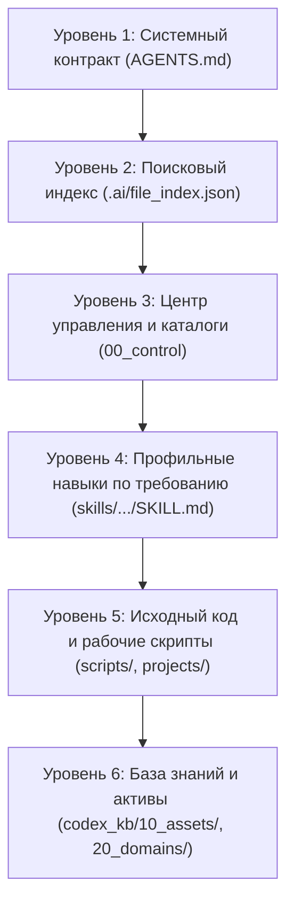

# 1. Принципы работы ИИ, архитектура контекста и приоритеты чтения

> **Назначение документа:** Фундаментальное руководство для пользователя и ИИ-ассистента. Объясняет внутренние механизмы обработки контекста LLM, природу «эффекта снежного кома», иерархию приоритетов файлов, технологию Token Guard и принципы безопасной работы в контуре Codex.

---

## 🧭 Содержание
1. [Анатомия контекстного окна и эффект снежного кома](#1-анатомия-контекстного-окна-и-эффект-снежного-кома)
2. [Иерархия и приоритеты чтения файлов (File Reading Priorities)](#2-иерархия-и-приоритеты-чтения-файлов)
3. [Механизм Lazy Loading (Ленивая загрузка навыков)](#3-механизм-lazy-loading-ленивая-загрузка-навыков)
4. [Token Guard и контекстная дисциплина (Context Discipline)](#4-token-guard-и-контекстная-дисциплина)
5. [Защита от вытеснения правил (Tail Pushing & Zero-Prose Guard)](#5-защита-от-вытеснения-правил-tail-pushing)
6. [Контракт безопасности Decision Policy (L0 — L6)](#6-контракт-безопасности-decision-policy-l0--l6)

---

## 1. Анатомия контекстного окна и эффект снежного кома

### Как языковая модель (LLM) «видит» диалог
У современных больших языковых моделей (Gemini 2.5 Pro / Flash, Claude 3.5 Sonnet, GPT-4o) **нет постоянной биологической памяти**. 
Каждый раз, когда вы отправляете новое сообщение в чат, система формирует **единый пакет входящих токенов (Input Tokens)** и заново отправляет его модели. Этот пакет включает:
1. **Системный промпт платформы** (системные инструкции Antigravity, описание доступных инструментов, дата, операционная система).
2. **Контракт правил пользователя** (содержимое файла `C:\Codex_Personal\AGENTS.md`).
3. **Сжатые манифесты доступных навыков** (названия и краткие описания из каталога `skills/`).
4. **Всю предыдущую историю сообщений текущего диалога** (вопросы пользователя, ответы ассистента, вызовы инструментов и их полные выводы из терминала).
5. **Ваше новое сообщение**.

### Природа «Эффекта снежного кома» (Context Bloat)
1. **Экспоненциальный рост затрат токенов**:
   - В начале чата размер контекста составляет 5 000 – 10 000 токенов. Один вопрос-ответ стоит доли цента.
   - Через 20–30 шагов с вызовами терминала, чтением логов и текстов скриптов размер контекста вырастает до **150 000 – 300 000 токенов**.
   - На шаге 30 модель перечитывает уже не просто ваш последний вопрос, а **все 300 000 токенов целиком**. Стоимость каждого отдельного ответа вырастает в 30 раз!
2. **Деградация внимания модели (Эффект «Lost in the Middle»)**:
   - Внимание трансформера распределяется неравномерно: максимальное внимание уделяется началу контекста (системный промпт) и самому концу (последнее сообщение пользователя).
   - Правила, договоренности и промежуточные выводы, затерявшиеся в середине огромного контекста (между 50-й и 200-й тысячами токенов), **начинают игнорироваться моделью**. Ассистент начинает «тупить», повторять старые ошибки или забывать ограничения.
3. **Выход из строя контекстного окна**:
   - При превышении физического окна модели или платформенного лимита система начинает принудительно усекать историю (`truncated_fields`), что приводит к потере нити рассуждения.

### Решение: Регулярное сжатие сессий (`/compress` или `«конец чата»`)
- Сессия должна быть короткой и сфокусированной: **не более 15–25 содержательных шагов**.
- По завершении логического блока задач подается команда **«конец чата»** (или `/compress`).
- Скрипт `scripts/session_compress.py`:
  - Фиксирует наработки в `.ai/SESSION_SUMMARY.md`;
  - Сохраняет новые правила в `AGENTS.md` и навыки;
  - Делает `git push origin master`;
  - Начинается новый чистый чат, где на старте загружается только компактная одноабзацная выжимка предыдущего чата!

---

## 2. Иерархия и приоритеты чтения файлов

Когда ИИ-ассистент начинает сессию или ищет ответ на ваш вопрос, файлы в проекте читаются строго по иерархии приоритетов.

### Детальная иерархия:
1. **Уровень 1: Системный контракт `AGENTS.md` (Высший приоритет)**
   - Загружается платформой **автоматически на каждом шаге**.
   - Содержит абсолютные запреты (Hard Constraints): запрет коммитить в рабочий репозиторий, запрет деплоя на VPS без согласования, правила B2B-переписки, формулы китайского снабжения, запрет 501 ошибки в 1С.
   - Ни один другой файл или команда пользователя не могут переопределить правила безопасности из `AGENTS.md` без явного согласия пользователя.
2. **Уровень 2: Быстрый поисковый индекс `.ai/file_index.json`**
   - Содержит хэши, пути и метаданные всех файлов проекта.
   - Вместо сканирования диска через `find` или `Get-ChildItem` ассистент мгновенно находит нужный файл через поиск по индексу за 1 миллисекунду.
3. **Уровень 3: Центр управления и каталоги (`codex_kb/00_control/`)**
   - `GRAVITY_CONTROL_CENTER.md` — быстрые фразы-триггеры, маршрутизация задач и карта контуров.
   - `SCRIPTS_CATALOG.md` — каталог скриптов по 14 доменным семействам инструментов (Tool Families).
   - `SKILLS.md` — реестр доступных навыков.
4. **Уровень 4: Профильные навыки (`skills/<навык>/SKILL.md`)**
   - Читаются **строго по требованию** (Lazy Loading). Если задача не касается 1С, файл `1c_unf/SKILL.md` НЕ читается.
5. **Уровень 5: Исходные скрипты и боевой код (`scripts/`, `projects/`)**
   - Читаются целевыми блоками (через `view_file` с указанием `StartLine` и `EndLine`), избегая загрузки мегабайтных файлов целиком.
6. **Уровень 6: База знаний (`codex_kb/10_assets/`, `codex_kb/20_domains/`)**
   - Инвентарь серверов, оборудования, пароли (через ссылки), архитектурные схемы.

---

## 3. Механизм Lazy Loading (Ленивая загрузка навыков)

Почему нельзя загружать все 15 навыков сразу в начале диалога?
- Каждый навык (`SKILL.md`) содержит от 300 до 1 000 строк подробнейших инструкций, примеров кода и краевых случаев.
- Загрузка всех навыков на старте сразу потратила бы **60 000 – 80 000 токенов контекста**, оставив минимум места для решения вашей фактической задачи.

### Как работает Lazy Loading в Antigravity:
1. **На старте:** В системный промпт передается только ультракороткий манифест (1–2 строки на навык: имя и краткое назначение).
2. **При появлении задачи:**
   - Если пользователь пишет: *«проверь порт Nginx на сервере»*, ассистент распознает триггер домена Linux, вызывает инструмент `view_file` для `skills/linux/SKILL.md`, загружает точные инструкции и выполняет задачу.
   - Если задача касается тендеров ГОЗ — подгружается только `tender_automation/SKILL.md`.
3. **Результат:** Экономия до 85% контекста и исключение путаницы инструкций между разными доменами.

---

## 4. Token Guard и контекстная дисциплина

Навык `Token Guard and Context Discipline` является обязательным фильтром перед каждым действием ассистента.

### Ключевые правила экономии токенов и лимитов платформы:
1. **Chaining (Группировка команд)**:
   - *Запрещено:* отправлять 5 отдельных вызовов `run_command` по 1 команде (`df -h`, затем `ls`, затем `cat`).
   - *Обязательно:* объединять последовательные команды в одну цепочку через `&&` или `;`, либо передавать упакованный Python-скрипт.
2. **Запрет циклического опроса (No Polling)**:
   - Платформа работает в режиме **реактивного пробуждения (Reactive Wakeup)**.
   - *Запрещено:* вызывать в цикле `manage_task(action='status')`, сжигая ходы модели.
   - *Обязательно:* запустить фоновую задачу и сразу завершить ход. Система сама разбудит ассистента сообщением по завершении.
3. **Точечное чтение файлов (Slice Reading)**:
   - *Запрещено:* читать файл на 2 000 строк целиком ради поиска одной функции.
   - *Обязательно:* использовать `StartLine` и `EndLine` или специализированный скрипт поиска.
4. **Компактность ответов в чате (UI Hygiene)**:
   - Все тяжелые аналитические отчеты, логи и списки сохраняются в виде Markdown-файлов на диске (`C:\Users\Артем\Desktop\` или `codex_kb/`).
   - В чат выдается **только краткая сводка (10–15 строк)** с прямыми кликабельными ссылками на созданные файлы.

---

## 5. Защита от вытеснения правил (Tail Pushing)

### Проблема «Tail Pushing» (Вытеснение правил из хвоста)
Когда в файл `AGENTS.md` правила добавляются линейно друг за другом, файл вырастает до 200–300 строк.
- Критические запреты (например: ошибка 501 в 1С при запросе ИНН, лимит 21 день в B2B, 15 знаков в номере тендера АСТ ГОЗ), добавленные в самый конец файла, попадают в зону риска:
  1. При частичном усечении файла инструментом они отсекаются первыми.
  2. Модель уделяет «хвосту» длинного контракта меньше внимания, чем заголовку.

### Трехуровневая защита:
1. **Компактная матрица триггеров в начале `AGENTS.md`**: Все ключевые быстрые триггеры (`конец чата`, `полная ревизия и форматирование гравити`, `follow up deals today`, `почисти и проверь мой ПК`) зафиксированы в верхних 40 строках контракта.
2. **Вынос детальных регламентов в профильные навыки**: Подробные правила (например, все тонкости OData 1С или схемы мотивации в Китае) вынесены в `skills/1c_unf/` и `codex_kb/20_domains/`. В `AGENTS.md` остаются только жесткие запретительные тезисы.
3. **Zero-Prose Guard**: Запрет любых «светских бесед» и прощаний до выполнения системного скрипта фиксации.

---

## 6. Контракт безопасности Decision Policy (L0 — L6)

Каждое действие ИИ в системе оценивается по уровню риска перед выполнением:

| Уровень | Описание операции | Действие ассистента | Примеры в контуре |
| :---: | :--- | :--- | :--- |
| **L0** | Пассивное чтение файлов, статус сервисов | Выполняется свободно | Просмотр файлов проекта, `git status`, чтение индекса |
| **L1** | Локальные вычисления, форматирование | Выполняется свободно | Запуск тестов, проверка синтаксиса, парсинг логов |
| **L2** | Редактирование файлов в личном контуре | Выполняется свободно | Правка кода в `C:\Codex_Personal`, генерация файлов на Desktop |
| **L3** | Создание локальных бэкапов, перезапуск скриптов | Уведомление пользователя | Пересборка поискового индекса, запуск полного аудита гравити |
| **L4** | Запись в боевую 1С, отправка писем клиентам | **СТРОГО ПОСЛЕ ПОДТВЕРЖДЕНИЯ** | Dry-run отчет в чат ➔ подтверждение ➔ запись в 1С/Б24 |
| **L5** | Модификации на боевом VPS сервере | **СТРОГО ПОСЛЕ ПОДТВЕРЖДЕНИЯ** | Перезапуск Docker-контейнеров, правка crontab, Nginx/Apache |
| **L6** | Изменение рабочего Git (`tender-rag-api`) | **КАТЕГОРИЧЕСКИ ЗАПРЕЩЕНО** | Репозиторий `wlissespanchame370-cyber` строго READ-ONLY |

---
> **Итог:** Соблюдение этих принципов гарантирует мгновенную скорость работы ассистента, исключение ошибок и «галлюцинаций», минимальный расход токенов и абсолютную безопасность ваших боевых данных в 1С, CRM и на сервере VPS.
