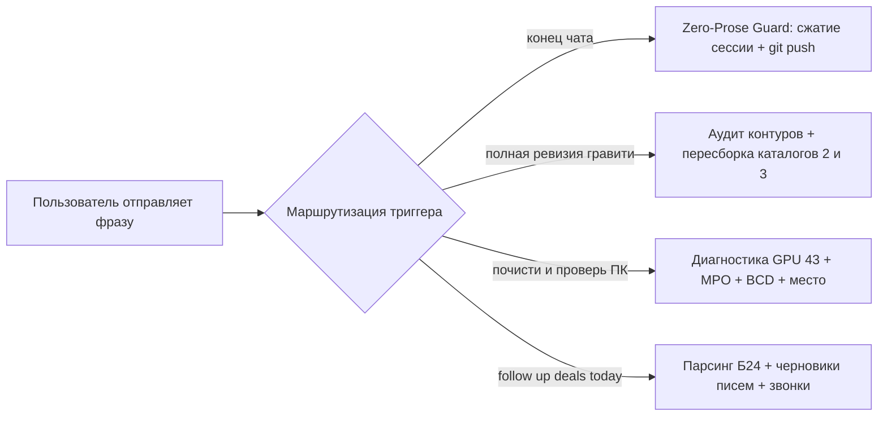

# 3. Все команды и фразы-триггеры ИИ (Единый справочник)

> **Дата последней автоматической ревизии:** `2026-09-26 09:50:46`  
> **Статус документа:** Автообновляемый мастер-реестр. Автоматически пересобирается при запуске `«полная ревизия и форматирование гравити»`.  
> **Охват:** Быстрые фразы-триггеры (Zero-Prose Guard) + Анализ 190 уникальных архивных директив + Прикладные команды по 7 доменам + Системные скрипты контура.

---

## 🧭 Навигация
1. [Аналитический разбор: почему в архивах 190 запросов, а в шпаргалке меньше?](#1-аналитический-разбор-почему-в-архивах-190-запросов-а-в-шпаргалке-меньше)
2. [Быстрые фразы-триггеры (Мгновенное выполнение и Zero-Prose Guard)](#2-быстрые-фразы-триггеры-мгновенное-выполнение-и-zero-prose-guard)
3. [Боевые команды по доменам (1С, CRM, Почта, ГОЗ, VPS, Железо, Китай)](#3-боевые-команды-по-доменам)
4. [Каталог готовых скриптов контура (Запуск через `py ...`)](#4-каталог-готовых-скриптов-контура-запуск-через-py-)
5. [Регламентные периодические процедуры (Daily / Weekly / Monthly)](#5-регламентные-периодические-процедуры)

---

## 1. Аналитический разбор: почему в архивах 190 запросов, а в шпаргалке меньше?

При глубоком аудите 43 551 сообщения из 94 сессий за 35 дней работы скрипт извлек **377 директив** с повелительными глаголами, которые сгруппировались в **190 уникальных пользовательских конструкций**.

### Куда делись остальные из 190 и нужны ли они?
Все 190 запросов делятся на 3 принципиально разные категории:
1. **Категория А: Боевые многоразовые команды и триггеры (~40 штук)**:
   - Это команды, которые вы отдаете регулярно: сжать сессию, проверить почту, запустить follow-up сделок, пересобрать каталог, сделать бэкап, проверить порты VPS, сбросить дисплеи.
   - **Они включены в данный справочник в полном объеме.**
2. **Категория Б: Одноразовые контекстные замечания (~120 штук)**:
   - Примеры из архивов: *«тут наталья адресат, а он пишет Анжелика»*, *«замени букву диска на F:»*, *«проверь файл report (3) (1).md»*, *«почему дело на сегодня называется CRM_TODO»*, *«cpus: 1.0»*, *«подпись сделай 12pt Times New Roman»*.
   - *Нужны ли они в виде отдельных команд для вызова?* **Нет**, потому что задача уже прошла, а контекст изменился.
   - *Где они сохранены?* Они были **кристаллизованы в системные правила** (`AGENTS.md`) и логику скриптов: теперь ИИ всегда автоматически проверяет соответствие имени адресата, использует правильную верстку подписи и знает правильный формат полей.
3. **Категория В: Диагностические и поисковые микрокоманды (~30 штук)**:
   - Разовые запросы: *«найди где лежит файл с ИНН»*, *«покажи свободное место на диске»*, *«почему упал контейнер n8n»*.
   - Они оформлены в данном файле как типовые шаблоны прикладных команд по доменам.

---

## 2. Быстрые фразы-триггеры (Мгновенное выполнение и Zero-Prose Guard)

Эти фразы вызывают мгновенную автоматическую реакцию ассистента **без лишних разговоров и подтверждений**:

| Ваша фраза в чате | Алиасы команды | Что немедленно выполняет ИИ-ассистент |
| :--- | :--- | :--- |
| **`«конец чата»`** | `/compress`, `/end-session`, `!конец`, `CMD: КОНЕЦ ЧАТА` | **Zero-Prose Guard:** запрет вежливых бесед до выполнения инструментов. Запускает `py scripts/session_compress.py`, синхронизирует выработанные правила в `AGENTS.md` и навыки, очищает `scratch/`, делает `git push origin master` и выводит одноабзацный итог с промптом для нового чата. |
| **`«полная ревизия и форматирование гравити»`** | `/audit`, `ревизия гравити`, `обнови каталоги` | Запускает `py scripts/full_gravity_audit.py`: сканирует Personal + Shared + tender-rag, отсекает вендоров, дедуплицирует скрипты, пересобирает `codex_kb/SCRIPTS_CATALOG.md` и автоматически обновляет файлы `2_...` и `3_...` на Рабочем столе. |
| **`«почисти и проверь мой ПК (ноутбук)»`** | `проверь victus`, `диагностика пк`, `проверь видеокарту` | Запускает экспресс-диагностику `py scripts/check_and_clean_pc.py`: проверяет статус NVIDIA RTX 3060 на Код 43, реестр дисплеев на фантомы `SIMULATED`, статус MPO, BCD F8, зависания Acrobat и свободное место на дисках C:, D:, F:. |
| **`«follow up deals today»`** | `ащддщ up deals today`, `разобрать сделки на сегодня` | Запускает `py projects/1c_odata/scripts/process_today_followup_deals.py`: ищет сделки на сегодня в Битрикс24, генерирует B2B-черновики в Roundcube `sales@longwang.ru` (папка `Черновики`), переносит дела на +4..5 дней, эскалирует звонки при >= 2 письмах и скачивает вложения с Диска. |

---

## 3. Боевые команды по доменам

### Домен 1: 1С:УНФ и OData интеграции
- **`«проверь контрагента по ИНН <ИНН> в 1С»`** — быстрый поиск контрагента через OData с получением реквизитов, долгов и менеджера.
- **`«найди лид по ИНН <ИНН> в 1С»`** — поиск в `Catalog_Лиды` строго по полю `Тема` через `substringof('{inn}', Тема)` (защита от ошибки 501).
- **`«выгрузи заказы покупателей за <период> из 1С»`** — формирование выборки заказов с отбором по проведенным расходным накладным (статус фактической отгрузки).
- **`«сделай сухой прогон (dry-run) синхронизации лидов с 1С»`** — проверка связки Битрикс24 ⮂ 1С без физической записи в базу.
- **`«запиши проверенные лиды в 1С»`** — физическая запись в `Catalog_Лиды` под логином `odata.writer` (строго после одобрения dry-run).

### Домен 2: Битрикс24 и Почтовый контур (Long Wang)
- **`«проверь входящие письма в sales@longwang.ru»`** — сканирование почтового ящика через IMAP, фильтрация автоответчиков, мусора и спама.
- **`«сгенерируй follow-up черновики для сделок»`** — создание B2B-писем по стандартам Long Wang (тема с брендом и суффиксом компании, запрет заискивающих фраз «аккуратно уточнить», фирменная подпись).
- **`«проверь bounce-письма (отскоки)»`** — обнаружение писем от `mailer-daemon` / `postmaster`: удаление невалидного email из контакта с сохранением самого контактного лица.
- **`«скачай вложения по сделке <ID> с Google Диска»`** — проверка прав доступа и скачивание документов сделки в локальный рабочий контур.

### Домен 3: Тендеры и АСТ ГОЗ
- **`«распарси процедуру ГОЗ <15-значный номер>»`** — скачивание и разбор извещения строго по 15-значному номеру (на `26...`). Запрет 11-значного ЕИС!
- **`«извлеки спецификацию из DOCX/PDF тендера»`** — конвертация документации через MarkItDown и извлечение таблиц через Gemini с контролем RPM.
- **`«рассчитай НМЦК и сведи лоты в Excel»`** — расчет начальной максимальной цены контракта и объединение лотов в сводную таблицу.

### Домен 4: Сервер VPS Linux и Docker
- **`«проверь статус сервисов и контейнеров на VPS»`** — безопасный пассивный аудит: `docker ps`, статус портов Nginx (80/443), Apache, n8n, Metabase.
- **`«проверь диск и память на сервере»`** — вывод `df -h`, `free -m`, поиск тяжелых логов Docker без блокировки I/O.
- **`«сделай бэкап базы n8n на сервере»`** — проверка размера SQLite: если база > 1 ГБ, бэкапятся строго исходники и схемы; если < 1 ГБ — безопасное сжатие без WAL.
- **`«перезапусти контейнер <имя> через compose»`** — перезапуск через `docker-compose up -d --build --force-recreate` по стандарту Compose 3.3. **Запрет `docker-compose down`!**

### Домен 5: Ноутбук HP Victus 16 и Дисплеи
- **`«сбрось кэш дисплеев»`** — очистка реестра от фантомных мониторов `SIMULATED`, отключение `HiberbootEnabled = 0`, отключение бага MPO `DisableOverlays = 1`.
- **`«проверь видеокарту на Код 43»`** — проверка привязки пакета `nvhmi.inf` для NVIDIA RTX 3060 и стабильности базового видеоадаптера Intel.
- **`«проверь меню F8 Safe Mode»`** — проверка конфигурации BCD (`bootmenupolicy legacy`, `timeout 0`).
- **`«почини зависание Adobe Acrobat»`** — завершение зависших фоновых процессов `AcroRd32.exe`, очистка временного кэша PDF.

### Домен 6: Снабжение и ВЭД в Китае (Дечжоу)
- **`«рассчитай фонд премирования отдела снабжения»`** — расчет по формуле: `5000 RMB оклад + 1% GMV + 10% возврат НДС + 100 RMB/заказ`.
- **`«подготовь ТЗ для китайского снабженца»`** — составление описания вакансии с жестким табу на откаты (反回扣), полным рабочим днем и отсутствием халявы.
- **`«распознай ответ китайского кандидата в почте»`** — сопоставление ответов с мобильных ящиков QQ Mail по цитате исходного письма (`收件人:`).

### Домен 7: Управление контекстом, Git и файлы
- **`«найди файл <имя/маска> в проекте»`** — мгновенный поиск через индекс `.ai/file_index.json`.
- **`«закоммить и запушь изменения»`** — создание аккуратного коммита в личный репозиторий `artem9119130838-glitch/codex-work.git`.
- **`«пересобери поисковый индекс»`** — запуск `py scripts/build_index.py` для актуализации всех 650+ файлов контура.

---

## 4. Каталог готовых скриптов контура (Запуск через `py ...`)

Все скрипты контура запускаются на хосте Windows **строго через лаунчер `py`**:

| Скрипт | Команда вызова | Что делает |
| :--- | :--- | :--- |
| **Сжатие сессии** | `py scripts/session_compress.py` | Фиксация итогов, обновление контракта, `git push origin master`. |
| **Полный аудит гравити** | `py scripts/full_gravity_audit.py` | Сканирование всех репозиториев, пересборка каталога и файлов 2 и 3. |
| **Экспресс-чистка ПК** | `py scripts/check_and_clean_pc.py` | Проверка GPU 43, MPO, фантомных экранов, дисков C:, D:, F:. |
| **Поисковый индекс** | `py scripts/build_index.py` | Мгновенный индекс `.ai/file_index.json` для всех файлов контура. |
| **Follow-up сделок Б24** | `py projects/1c_odata/scripts/process_today_followup_deals.py` | Обработка задач CRM_TODO, черновики в Roundcube, звонки. |
| **Сверка 1С и Б24** | `py projects/1c_odata/scripts/reconcile_leads_with_1c.py` | Идемпотентная сверка лидов и контрагентов по OData. |
| **Аудит архивных сессий** | `py scripts/audit_archived_transcripts.py --mode all` | Глубокий анализ истории чатов brain на предмет директив и правил. |
| **Сброс дисплеев Victus** | `powershell -File scripts/reset_display_cache.ps1` | Очистка реестра GraphicsDrivers, отключение MPO и сна. |

---

## 5. Регламентные периодические процедуры

### Ежедневно (Daily):
1. **Утро:** `«follow up deals today»` — разбор задач CRM, подготовка черновиков писем клиентам.
2. **Вечер:** `«конец чата»` — фиксация наработок дня, сжатие контекста, пуш в Git.

### Еженедельно (Weekly):
1. `«почисти и проверь мой ПК (ноутбук)»` — проверка целостности видеодрайверов, свободного места и реестра.
2. `«полная ревизия и форматирование гравити»` — актуализация каталогов скриптов и навыков.

### Ежемесячно (Monthly):
1. Аудит диска сервера VPS (`/Storage`, SQLite вакуумирование n8n).
2. Ротация архивов логов и синхронизация бэкапов на внешний диск F: (`Codex Backup`).

---
> **Итог:** Этот справочник объединяет весь 35-дневный опыт вашего взаимодействия с ассистентом. Любая из этих команд готова к мгновенному выполнению!
