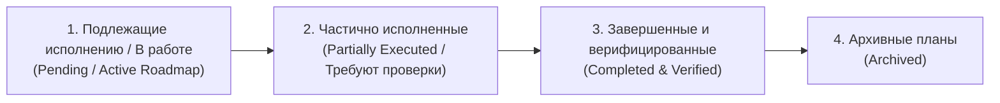

# Единый реестр архитектурных и рабочих планов контура (PLANS_REGISTRY)

> **Статус документа:** Мастер-реестр планов проекта Codex.  
> **Правило ведения:** Любой комплексный план перед выполнением фиксируется в этом реестре. Планы разделяются по жизненному циклу: 1) Подлежащие исполнению (Pending / В работе), 2) Частично исполненные (Partially Executed / До проверки), 3) Завершенные и верифицированные (Completed & Verified).

---

## 🧭 Навигация по статусам планов

---

## 1. Планы, подлежащие исполнению и активные дорожные карты (Pending Execution / Active Roadmaps)
*Стратегические и комплексные планы, находящиеся в процессе реализации по этапам/спринтам:*

1. [**Генеральный архитектурный мастер-план и 4-спринтовый Roadmap B2B-продукта (B2B AI Nexus)**](file:///C:/Codex/docs/B2B_UNIFIED_PRODUCT_ARCHITECTURE_AND_ROADMAP.md)
   - **Файл на Рабочем столе:** [`C:\Users\Артем\Desktop\B2B_UNIFIED_PRODUCT_ARCHITECTURE_AND_ROADMAP.md`](file:///C:/Users/Артем/Desktop/B2B_UNIFIED_PRODUCT_ARCHITECTURE_AND_ROADMAP.md)
   - **Дата:** `2026-09-29`
   - **Контур:** Вся инфраструктура B2B — Hexagonal Architecture, Alembic, MinIO Claim Check, Circuit Breaker, DLQ, интеграция 1С:УНФ, Bitrix24, Новофон телефония, скоринг DaData/Saby, почтовый контур.
   - **Статус реализации:** В работе. Спринт 1 (Foundation & Resilience) разворачивается согласно графику; наработки контура Codex (скоринг, зеркальная синхронизация, Follow-Up сделок) полностью инвентаризированы.

2. [**Автоматическая реанимация лидов 1С (Lead Reactivation Pipeline)**](file:///C:/Codex/projects/lead_reactivation/README.md)
   - **Папка проекта:** [`C:\Codex\projects\lead_reactivation\`](file:///C:/Codex/projects/lead_reactivation/)
   - **Манифест регламента:** [LEAD_REACTIVATION_POLICY.md](file:///C:/Codex/projects/lead_reactivation/LEAD_REACTIVATION_POLICY.md)
   - **Дата:** `2026-10-03`
   - **Контур:** База спящих контактов 1С:УНФ (`onec_contacts`), DWH `marketing_db`, IMAP Roundcube (`sales@longwang.ru`), CRM Битрикс24.
   - **Статус реализации:** **В РАБОТЕ / НЕЗАВЕРШЕННЫЙ (WIP)**. Сняты лимиты 100 запросов DeepSeek, внедрен регламент обязательного вложения презентации и исторического КП, формализована карта двух воронок (Поток 1: касания 1–6 с кулдауном 21 день; Поток 2: охват базы 1С). Ведется интеграция с CRM Bitrix24 для исключения конфликтов с активными сделками.

---

## 2. Частично исполненные планы (Partially Executed / Подлежат проверке и валидации)
*Планы, техническая часть которых реализована (написан код, созданы скрипты), но требуется боевая проверка на реальных данных или подтверждение пользователем:*

- *(в настоящее время все локальные конвейеры CRM прошли боевую верификацию и переведены в Раздел 3)*

---

## 3. Завершенные и верифицированные планы (Completed & Verified)
*Планы, полностью реализованные, кодифицированные в правилах и прошедшие проверку в бою:*

1. [**Локальный план архитектурного разделения конвейеров обработки лидов и синхронизации 1С ⮂ Bitrix24**](file:///C:/Codex/docs/plans/2026-09-29_lead_processing_and_sync_plan.md)
   - **Файл на Рабочем столе:** [`C:\Users\Артем\Desktop\lead_processing_architecture_plan.md`](file:///C:/Users/Артем/Desktop/lead_processing_architecture_plan.md)
   - **Дата:** `2026-09-29` — `2026-09-30`
   - **Контур:** CRM Битрикс24, 1С:УНФ OData, IMAP/SMTP Hostland, Снабжение Miss Wang (`user/30`).
   - **Результат:** 
     * Созданы независимые монолиты `process_incoming_sales_leads.py` и `sync_leads_1c_bitrix.py`;
     * Внедрен автоответ по Шаблону № 66 и автоматическая пометка входящих писем прочитанными (`COMPLETED: 'Y'`);
     * Внедрен регламент пуш-уведомлений Miss Wang: тег `[USER=30]王女士[/USER]`, прикрепление чистового Excel с Рабочего стола в проект 14 («Товары и поставщики Китай») и тег `Поиск товара - 找货`;
     * Зафиксирована каноническая маска наименований Сделки и Задачи: `{Компания}, {Товар на китайском / бренд + категория CN + модель}` и строгое равенство **Имя Задачи = Имя Сделки**;
     * Внедрена многопользовательская маршрутизация (`--assigned-to`) с Артемом в роли наблюдателя;
     * Закреплен регламент сохранения неотлаженных скриптов в `ARCHIVE/leads_processing_research_scratch/`;
     * **Боевая валидация успешно завершена:** подтверждена на реальных заявках АО «Илья Муромец» (Лид 7680, Сделка 2358, Задача 4668), ООО «ИНФАМЕД К» (Лид 17812, Сделка 2356) и АО «Волтайр-Пром» (Лид 17794, Сделка 2360, Задача 4672).
2. [**Регламент двухфазной записи и валидации лидов 1С:УНФ (Zero-Blank Lead Guard)**](file:///C:/Codex/projects/1c_odata/AGENTS.md)
   - **Дата:** `2026-09-29`
   - **Результат:** Ликвидирована проблема пустых лидов в 1С:УНФ; внедрен обязательный POST базовых реквизитов -> PATCH табличной части `КонтактнаяИнформация` -> перелинковка `Document_Событие` -> контрольный GET-запрос.
3. [**Регламент B2B follow-up и цепочки настойчивости по незавершенным сделкам**](file:///C:/Codex/projects/1c_odata/scripts/process_today_followup_deals.py)
   - **Дата:** `2026-09-28`
   - **Результат:** Автогенерация персонализированных черновиков с прикреплением файлов КП в IMAP Roundcube, перенос CRM_TODO (+4..5 дн.), эскалация звонков при >= 3 касаниях без ответа.
