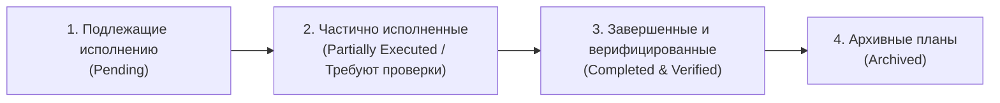

# Единый реестр архитектурных и рабочих планов контура (PLANS_REGISTRY)

> **Статус документа:** Мастер-реестр планов проекта Codex.  
> **Правило ведения:** Любой комплексный план перед выполнением фиксируется в этом реестре. Планы разделяются по жизненному циклу (ожидающие исполнения, частично исполненные до верификации, завершенные и архивные).

---

## 🧭 Навигация по статусам планов

---

## 1. Планы, подлежащие исполнению (Pending Execution)
*Планы, которые согласованы с пользователем, но еще не начаты реализацией:*
- *(в настоящее время все утвержденные планы переведены в стадию исполнения)*

---

## 2. Частично исполненные планы (Partially Executed / Подлежат проверке и валидации)
*Планы, техническая часть которых реализована (написан код, созданы скрипты), но требуется боевая проверка на реальных данных или подтверждение пользователем:*

1. [**План рефакторинга конвейеров обработки лидов и синхронизации 1С ⮂ Bitrix24**](file:///C:/Codex/docs/plans/2026-09-29_lead_processing_and_sync_plan.md)
   - **Дата:** `2026-09-29`
   - **Контур:** CRM Битрикс24, 1С:УНФ OData, IMAP/SMTP Hostland, Снабжение Miss Wang (`user/30`).
   - **Что сделано:** Собраны монолиты `process_incoming_sales_leads.py` и `sync_leads_1c_bitrix.py`, интегрирован Шаблон № 66, внедрен стандарт пинга `[USER=30]王女士[/USER]`, выполнен hotfix задачи № 4668, исследовательские скрипты архивированы в `ARCHIVE/leads_processing_research_scratch/`.
   - **Что подлежит проверке:** Боевой прогон конвейера при поступлении следующего реального входящего запроса на `sales@longwang.ru`.

---

## 3. Завершенные и верифицированные планы (Completed & Verified)
*Планы, полностью реализованные и прошедшие проверку в бою:*

1. [**Регламент двухфазной записи и валидации лидов 1С:УНФ (Zero-Blank Lead Guard)**](file:///C:/Codex/projects/1c_odata/AGENTS.md#L124-L132)
   - **Дата:** `2026-09-29`
   - **Результат:** Ликвидирована проблема отображения пустых лидов в экранных формах e1cib/data/Справочник.Лиды; внедрен обязательный POST базовых реквизитов $\to$ PATCH табличной части `КонтактнаяИнформация` $\to$ контрольный GET-запрос верификации.
2. [**Регламент B2B follow-up и цепочки настойчивости по незавершенным сделкам**](file:///C:/Codex/projects/1c_odata/scripts/process_today_followup_deals.py)
   - **Дата:** `2026-09-28`
   - **Результат:** Автогенерация черновиков с прикреплением файлов КП в IMAP Roundcube, перенос CRM_TODO (+4..5 дн.), эскалация звонков при $\ge 2$ письмах.
