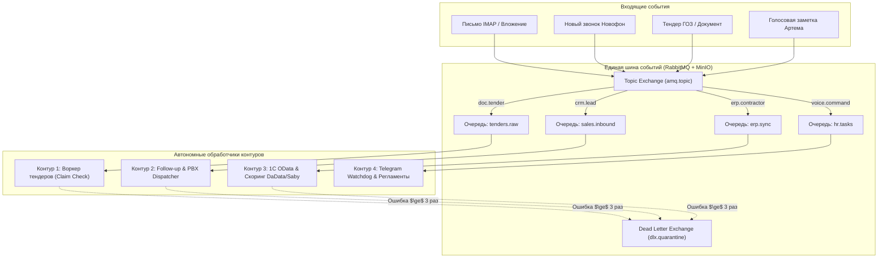
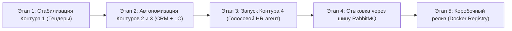

# Единая платформа операционной эффективности и продаж (B2B AI Nexus)
## Архитектура 4 изолированных контуров («Порезка слона на бифштексы») и прагматичный план перехода к готовому продукту

> **Статус документа:** Архитектурная концепция, декомпозиция контуров и реалистичный Roadmap тиражируемого B2B-продукта.  
> **Авторы:** Артем (Product Owner, архитектор бизнес-процессов), Михаил (Lead Backend & Infrastructure Engineer).

---

## 1. Главный принцип: «Порезка слона на 4 независимых бифштекса»

Попытка механически «свалить в одну кучу» и связать воедино за короткий срок сырые автоматизации тендеров, 1С, CRM, телефонии и HR неизбежно приведет к архитектурному коллапсу, срыву сроков и бесконечным багам.

Поэтому мы разделяем систему на **4 абсолютно независимых контура (Decoupled Contours)**.  
Каждый контур решает свою законченную бизнес-задачу, имеет собственного владельца, развивается и тестируется в изолированной песочнице, а общается с остальным миром исключительно через **стандартизированные JSON-контракты** шины событий.

```
                           ┌─────────────────────────────────────────────────────────┐
                           │               ВХОДЯЩИЕ ПОТОКИ И ИНТЕРФЕЙСЫ              │
                           │  Почта IMAP  │  АСТ ГОЗ / ЕИС  │  Новофон  │  Голос TG  │
                           └────────────────────────────┬────────────────────────────┘
                                                        ▼
                           ┌─────────────────────────────────────────────────────────┐
                           │      ШИНА СОБЫТИЙ И ХРАНИЛИЩЕ (RABBITMQ + MINIO S3)     │
                           │       Сквозной Trace ID  │  Claim Check  │  DLQ         │
                           └──────┬──────────────┬──────────────┬──────────────┬─────┘
                                  │              │              │              │
        ┌─────────────────────────┘              │              │              └────────────────────────┐
        ▼                                        ▼              ▼                                       ▼
┌─────────────────────────┐   ┌─────────────────────────┐   ┌─────────────────────────┐   ┌─────────────────────────┐
│        КОНТУР 1         │   │        КОНТУР 2         │   │        КОНТУР 3         │   │        КОНТУР 4         │
│      ТЕНДЕРНЫЙ RAG      │   │   ПРОДАЖИ И CRM SENTINEL│   │     1С:УНФ И СКОРИНГ    │   │      HR & ОПЕРАЦИИ      │
│  (Зона Михаила)         │   │   (Зона Артема)         │   │   (Зона Артема)         │   │   (Голосовой агент)     │
│ ─────────────────────── │   │ ─────────────────────── │   │ ─────────────────────── │   │ ─────────────────────── │
│ • Парсинг PDF/DOCX ГОЗ  │   │ • Follow-up черновики   │   │ • 1С OData (Read/Write) │   │ • Голосовые регламенты  │
│ • Векторная Белая база  │   │ • Новофон АТС (JSON-RPC)│   │ • DaData + Saby скоринг │   │ • Надзор задач в CRM    │
│ • Регуляторное сито     │   │ • Спасение писем от отрыва│ • Зеркальная база 1С/CRM│   │ • RAG-анализ резюме     │
│ • Claim Check / Alembic │   │ • Кулдаун и эскалация звонков│ • Реактивация старой базы│ • Аудио-сводки директору│
└─────────────────────────┘   └─────────────────────────┘   └─────────────────────────┘   └─────────────────────────┘
```

**Ключевая надежность:**  
Если 1С (Контур 3) зависнет на закрытии месяца или упадет интернет — Тендерный RAG (Контур 1), Телефония (Контур 2) и Голосовой HR-ассистент (Контур 4) **продолжают работать штатно**, не замечая сбоя. Задачи для 1С спокойно накапливаются в очереди RabbitMQ.

---

## 2. Детальное описание 4 контуров продукта

### Контур 1: Тендерный RAG и спецификации (Зона ответственности: Михаил)
* **Бизнес-задача:** Автоматический разбор сложных спецификаций, опрос Белой базы, отсев нерелевантных лотов и формирование итогового расчета без ручного чтения сотен страниц ТЗ.
* **Вход:** Ссылки на файлы извещений, сканы PDF/DOCX (через камеру хранения MinIO Claim Check).
* **Выход:** Стандартизированный JSON-отчет `TenderEvaluationReport` (позиции, цены Белой базы, риски ГОЗ, вердикт).
* **Сквозные улучшения Михаила, реализуемые здесь:**
  1. `Alembic` для управления версиями PostgreSQL (pgvector + metadata);
  2. `MinIO S3` для тяжелых файлов (в RabbitMQ ходит только дескриптор с URI);
  3. `Dead Letter Queue (DLQ)` для изоляции битых документов (защита воркера от зацикливания);
  4. `Circuit Breaker` для ротации ключей Gemini $\to$ DeepSeek с мягким кулдауном;
  5. Перенос секретных ключей из URL (`?auth=...`) в безопасные заголовки `Authorization: Bearer <JWT>`.

---

### Контур 2: Продажи, Follow-Up и телефония (Зона ответственности: Артем / Codex)
* **Бизнес-задача:** Защита от потери клиентов, дожим зависших коммерческих предложений и сквозная интеграция телефонных разговоров без участия человека.
* **Что уже разработано и работает в боевом режиме:**
  1. **Конвейер Follow-Up сделок ([`deal_followup_pipeline.py`](file:///C:/Codex/projects/1c_odata/scripts/deal_followup_pipeline.py), [`process_today_followup_deals.py`](file:///C:/Codex/projects/1c_odata/scripts/process_today_followup_deals.py)):**
     * Мониторинг просроченных дел в сделках Битрикс24;
     * Сбор КП и спецификаций с диска с сохранением кириллических имен по RFC 2231;
     * Автоматическая подготовка персонализированных черновиков в почтовом ящике Roundcube (`sales@longwang.ru`);
     * Кулдаун 7–10 дней, перенос `CRM_TODO` на +4..5 дней и эскалация в звонок при $\ge 2$ неотвеченных письмах.
  2. **Интеграция телефонии Новофон ([Novofon Telephony Skill](file:///C:/Users/Артем/.gemini/config/skills/novofon_telephony/SKILL.md)):**
     * JSON-RPC 2.0 интеграция с АТС Новофон (`dataapi-jsonrpc.novofon.ru/v2.0`);
     * Нормализация номеров строго по стандарту `7XXXXXXXXXX` (без плюса);
     * Парсинг добавочных номеров из подписей писем и карточек CRM в `patronymic` (`доб. 123`);
     * Мгновенный Caller ID: софтфон менеджера сразу показывает имя клиента из 1С/CRM при входящем звонке.
  3. **Ликвидатор потери писем (Inbound Mail Activity Sentinel):**
     * Автоматический перехват писем с новых адресов известных клиентов и жесткая привязка `CRM_EMAIL` к текущей активной сделке вместо создания мусорных лидов-дубликатов.

---

### Контур 3: 1С:УНФ, скоринг контрагентов и учет (Зона ответственности: Артем / Codex)
* **Бизнес-задача:** Безопасный финансовый учет, квалификация входящих компаний и единая клиентская база без расхождения данных между бухгалтерией и отделом продаж.
* **Что уже разработано и работает в боевом режиме:**
  1. **Модуль квалификации и скоринга контрагента ([`check_contractor.py`](file:///C:/Codex/projects/1c_odata/scripts/check_contractor.py)):**
     * Мгновенный опрос DaData (ИНН, КПП, ОГРН, адреса, руководители, ОКВЭД);
     * Парсинг сессий СБИС (Saby) без платного API ВОК (подсчет участий в торгах в роли поставщика и заказчика);
     * Автоматическое тегирование: `Перепродажник`, `Конечный покупатель`, `Производство`, `Тендер`, `Холдинг`.
  2. **Зеркальная синхронизация 1С:УНФ и CRM ([`search_1c_entities.py`](file:///C:/Codex/projects/1c_odata/scripts/search_1c_entities.py), [`sync_to_bitrix.py`](file:///C:/Codex/projects/1c_odata/scripts/sync_to_bitrix.py)):**
     * Idempotent OData PATCH в 1С при изменении контактов в CRM, и зеркальный REST update в CRM при изменении в 1С;
     * Защита от захламления базы пользовательскими полями `UF_*`;
     * Строгий протокол безопасности 1С: чтение (GET) и Dry-run без риска повреждения базы данных.
  3. **Реактивация спящей клиентской базы (Customer Reactivation):**
     * Выгрузка клиентов из 1С, переставших заказывать определенную номенклатуру, и генерация адресных предложений.

---

### Контур 4: Операционный контроль и HR-ассистент (Голосовой ИИ-агент)
* **Бизнес-задача:** Освобождение руководителя от ручного написания 50-страничных инструкций и ручного контроля подчиненных.
* **Ключевые модули (согласно концепции [`docs/HR_OPERATIONAL_AI_AGENT_CONCEPT.md`](file:///C:/Codex/docs/HR_OPERATIONAL_AI_AGENT_CONCEPT.md)):**
  1. **Voice-to-Regulation Engine:** Наговорил голосом 2–3 минуты в Telegram $\to$ Агент собрал корпоративный регламент со структурированным чек-листом $\to$ скриптом опубликовал в Базу Знаний CRM.
  2. **Daily CRM Task Watchdog:** Автоматический аудит задач снабжения (Азат, Ван) и логистики (Сауле) в 09:00 и 18:00. Пинг зависших задач без движения > 48 часов. Голосовой 30-секундный аудио-дайджест руководителю в Telegram.
  3. **Smart RAG Recruiter:** Автоматический скоринг резюме (Александра, Чулпан, 30+ китайских снабженцев: Nancy Qin, Ван Ванъюн, Госпожа Ань) по матрице требований (опыт ВЭД, станки, карго vs белая таможня), генерация писем и драфтов офферов с правильной формулой оклада (5 000 RMB + командный фонд).

---

## 3. Архитектура интеграции через Шину Событий (Event Contracts)

Вместо монолитных прямых вызовов сервисы общаются асинхронно через брокер RabbitMQ.



### Формат контракта (JSON-дескриптор с Claim Check):
```json
{
  "trace_id": "b2b-721fb82a-4809-437e",
  "event_type": "DOCUMENT_RECEIVED",
  "timestamp": "2026-09-29T15:20:00Z",
  "source": "IMAP_HOSTLAND",
  "payload": {
    "sender": "zakupki@vostport.ru",
    "inn": "2508001544",
    "claim_id": "claim_987654",
    "s3_uri": "s3://nexus-storage/2026/09/спецификация_метизы.docx",
    "mime_type": "application/vnd.openxmlformats-officedocument.wordprocessingml.document"
  }
}
```

---

## 4. Реалистичный пошаговый Roadmap внедрения

Мы уходим от нереалистичных сроков «всё за 8 недель». Реализация разбивается на **спокойные, независимые этапы**, где каждый этап дает законченный рабочий результат.



### Этап 1. Стабилизация Контура 1 (Тендерный RAG) — 4–6 недель
**Ответственный: Михаил**
* **Задача:** Довести тендерный конвейер до идеального инженерного состояния без оглядки на другие системы.
* **Что делается:**
  1. Внедрение `Alembic` для управления структурой PostgreSQL (pgvector + metadata).
  2. Развертывание `MinIO` в `docker-compose.yml` и перевод парсеров на паттерн Claim Check.
  3. Устранение токенов из URL (`?auth=...`), внедрение Bearer JWT авторизации.
  4. Настройка очередей RabbitMQ с Dead Letter Queue (DLQ).
  5. Внедрение Circuit Breaker с ротацией Gemini $\to$ DeepSeek при лимитах 429/503.
* **Критерий приемки:** Воркер тендеров стабильно «проглатывает» пачку из 50 тяжелых разнородных файлов (DOCX, PDF, битые файлы) без утечек памяти и без ручных вмешательств.

### Этап 2. Автономизация Контуров 2 и 3 (CRM, 1С, Телефония) — 4–5 недель
**Ответственный: Артем / Codex**
* **Задача:** Оформить существующие боевые Python-скрипты в чистые сервисы с интерфейсами адаптеров.
* **Что делается:**
  1. Упаковка конвейера Follow-Up продаж и IMAP-черновиков в автономный сервис `sales_sentinel`.
  2. Упаковка синхронизации адресной книги Новофон (JSON-RPC) в адаптер `PBXAdapter`.
  3. Оформление модуля квалификации DaData + Saby в адаптер `EnrichmentAdapter`.
  4. Фиксация контрактов данных 1С:УНФ (OData).
* **Критерий приемки:** Модули работают как фоновые демоны, отдают метрики и не требуют ручного запуска скриптов из командной строки.

### Этап 3. Запуск Контура 4 (Голосовой HR & Operations Agent) — 3–4 недели
**Ответственный: Артем / Codex**
* **Задача:** Запуск Telegram-бота с голосовым вводом для освобождения от рутины регламентов и контроля задач.
* **Что делается:**
  1. Telegram-бот с транскрипцией голосовых сообщений руководителя (Whisper).
  2. Шаблонизатор Voice-to-Regulation с авто-публикацией в Базу Знаний Битрикс24 по REST API.
  3. Фоновый опрос задач Битрикс24 (09:00 и 18:00) с генерацией коротких аудио-сводок руководителю.
  4. RAG-скоринг резюме соискателей на базе [`build_candidates_rag_db.py`](file:///C:/Codex/projects/HR/build_candidates_rag_db.py).
* **Критерий приемки:** Руководитель надиктовывает регламент за 3 минуты в телефон, и он появляется в CRM. Вечером бот присылает 30-секундный отчет по задачам.

### Этап 4. Стыковка контуров через Шину Событий (Event Bus Integration) — 3–4 недели
**Ответственные: Михаил, Артем**
* **Задача:** Соединить 4 готовых контура через брокер RabbitMQ.
* **Что делается:**
  1. Публикация событий из Контуров 1, 2, 3, 4 в общий брокер.
  2. Сквозной `trace_id` через OpenTelemetry (отслеживание жизненного цикла заявки от письма до 1С).
  3. Замена n8n на внутренний сервис-оркестратор на FastAPI.
* **Критерий приемки:** При поступлении письма со спецификацией автоматически отрабатывает тендерный воркер, результат уходит в CRM, создается черновик письма клиенту, а в 1С создается контрагент с тегами DaData/Saby.

### Этап 5. Упаковка в тиражируемый On-Premise дистрибутив — 2–3 недели
**Ответственные: Михаил, Артем**
* **Задача:** Подготовка коробки для продажи клиентам.
* **Что делается:**
  1. GitHub Actions CI/CD: сборка закрытых Docker-образов в GitHub Container Registry (GHCR).
  2. Клиентский установочный комплект: `docker-compose.yml`, `.env.example`, скрипт `install.sh`.
  3. Руководство администратора и пользователя.
* **Критерий приемки:** Продукт разворачивается на чистом Linux-сервере клиента за 15 минут одной командой.
