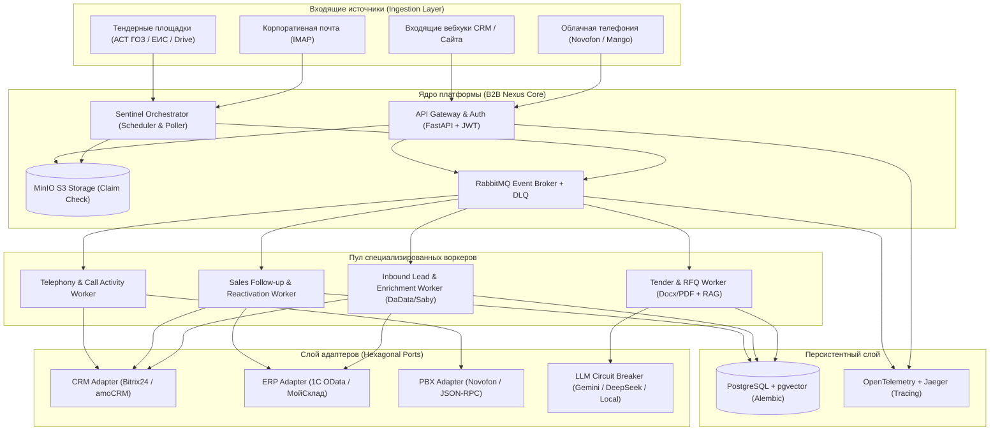
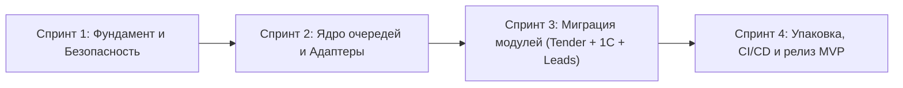

# Единая платформа операционной эффективности и продаж (B2B AI Nexus)
## Архитектурный разбор гипотез Михаила, интеграция наработок Codex и генеральный план тиражируемого MVP

> **Статус документа:** Архитектурная концепция, сравнительный аудит и Roadmap перехода к On-Premise / SaaS продукту  
> **Целевая аудитория:** Артем (Product Owner / Архитектор бизнес-процессов), Михаил (Lead Backend / Infrastructure Engineer)  
> **Основа анализа:** `C:\Users\Артем\Downloads\что сейчас делаем не так и как улучшить (глобально).md` + наработки репозитория `C:\Codex` (`projects/1c_odata/`, `novofon_telephony`, `tender-rag-api`).

---

## 1. Разбор и оценка 10 архитектурных гипотез Михаила

Михаил поднял фундаментальные вопросы зрелости продукта (Service-Oriented Architecture, паттерны отказоустойчивости и поставки). Ниже приведен критический анализ каждого пункта: что является абсолютным «must-have», что скорректировано под реалии малого B2B-бизнеса, и каков конкретный план внедрения.

| № | Гипотеза Михаила | Оценка зрелости | Вердикт и корректировка под реальный SMB-контур | План внедрения |
|---|---|---|---|---|
| **1** | **Жесткая привязка к Bitrix24 (Hexagonal Architecture)** | **10/10 (Критично)** | **Полностью утверждается.** Хардкод `b24_proxy`, колокольчиков Артема и полей `UF_CRM_*` делает продукт нетиражируемым. У клиентов бывает amoCRM, чистая 1С или Telegram-контуры. | Создать интерфейс `ICRMAdapter` (методы: `notify_manager`, `sync_contact`, `create_lead`, `push_activity`). Ядро публикует доменные события (`LeadCreated`, `TenderParsed`, `FollowupDue`), адаптеры ловят их через брокер. Для MVP реализуются `Bitrix24Adapter` и `MockAdapter`. |
| **2** | **Отказ от n8n в пользу внутреннего оркестратора** | **9/10 (Приоритетно)** | **Утверждается с заменой технологии.** Temporal — оверхед для On-Premise у малого бизнеса (требует Cassandra/тяжелый Postgres, 4+ ГБ RAM). Клиенты не потянут администрирование Temporal. | Заменить связку n8n на **FastAPI Coordinator + Celery / APScheduler / встроенный RabbitMQ Worker**. Легковесный сервис `sentinel_orchestrator` опрашивает IMAP, Диски, 1С OData и пушит задачи в RabbitMQ. Потребление RAM упадет с 2 ГБ до 150 МБ. |
| **3** | **Миграции БД через Alembic (вместо raw SQL)** | **10/10 (Критично)** | **Обязательно для MVP.** Без версионирования схемы данных любой апдейт контейнера у клиента приведет к несовместимости схемы и краху аналитики. | Внедрить `Alembic` для единой базы PostgreSQL (pgvector + metadata). Настроить `docker-entrypoint.sh` с вызовом `alembic upgrade head` перед стартом API Gateway и воркеров. |
| **4** | **Брокер для аналитики и ClickHouse** | **7/10 (Отрегулировано)** | **Паттерн верен, база скорректирована.** Отделять транзакции воркеров от записи аналитики — правильно. Но ClickHouse для SMB (сотни/тысячи документов в день) — избыточен по ресурсам. | Воркеры не делают `INSERT` в БД аналитики, а шлют событие `AnalyticsEvent` в RabbitMQ (`analytics_queue`). Микросервис `Analytics Consumer` собирает пачки (батчи по 50 записей или раз в 10 сек) и сбрасывает их в PostgreSQL. Архитектура готова к ClickHouse, но на старте не жрет память. |
| **5** | **Circuit Breaker для LLM-провайдеров** | **10/10 (Критично)** | **Расширяется на весь контур.** Паттерн жизненно необходим не только для Gemini/DeepSeek, но и для 1С OData (когда 1С зависает на закрытии месяца), DaData и Novofon API. | Реализовать Circuit Breaker (`pybreaker` / `tenacity`): при серии ошибок 429/503 шлюз переходит в `Open` (пауза 5–10 мин), сообщения в очереди замораживаются. Добавить **Multi-Tier Fallback**: Gemini 2.5/3 -> DeepSeek V3/R1 -> Локальная отложенная очередь. |
| **6** | **Токены в Query-параметрах (`?auth=...`)** | **10/10 (Безопасность)** | **Критическая уязвимость.** Токены оседают в логах Nginx, истории браузеров и Dozzle. В Enterprise-сегменте это стоп-фактор безопасности. | Перенос авторизации в заголовок `Authorization: Bearer <JWT>`. Реализация middleware в API Gateway с валидацией токена до проброса запроса во внутреннюю сеть. Для внешних вебхуков (Bitrix, почта) — проверка HMAC-SHA256 подписи. |
| **7** | **Монорепозиторий vs Независимый деплой** | **8/10 (Прагматично)** | **Разделение процесса разработки и поставки.** Сам репозиторий для нас удобнее держать единым (Monorepo), но поставка клиенту должна идти строго в скомпилированных образах. | Настроить GitHub Actions (CI/CD) на сборку образов в GitHub Container Registry (GHCR): `ghcr.io/nexus/gateway:v1.0`, `ghcr.io/nexus/worker:v1.0` и т.д. Клиент получает только `docker-compose.yml` и `.env`. Никаких `git pull` у клиента. |
| **8** | **Claim Check через S3/MinIO для тяжелых файлов** | **10/10 (Производительность)** | **Золотой стандарт.** Гонять через RabbitMQ PDF/DOCX по 50–100 МБ или дампы 1С недопустимо — брокер упадет по памяти (OOM Killer). | Развернуть локальный контейнер `MinIO` (S3-compatible). Gateway или Inbound-сервис сохраняет файл в бакет `raw-documents`, а в очередь передает квитанцию: `{"claim_id": "...", "s3_uri": "s3://tenders/doc1.pdf", "sha256": "..."}`. Воркер читает файл потоково. |
| **9** | **Распределенный трейсинг (OpenTelemetry + Jaeger)** | **9/10 (Сопровождение)** | **Необходимо для On-Premise поддержки.** Когда у клиента пропадет тендер или зависнет письмо, без трейсинга саппорт будет слепым. | Внедрить OpenTelemetry SDK в FastAPI и воркеры. Единый `trace_id` генерируется на входе и прокидывается через заголовки сообщений RabbitMQ. Клиент может активировать легкий контейнер Jaeger для диагностики. |
| **10** | **Dead Letter Queue (DLQ) для отравленных сообщений** | **10/10 (Отказоустойчивость)** | **Базовый стандарт очередей.** Битый скан, поврежденный OData XML или баг парсера не должны подвешивать конвейер в бесконечный retry-loop. | Настроить `x-dead-letter-exchange` в RabbitMQ. Сообщение после 3 неудачных попыток уходит в `quarantine_queue`. В админ-панели / CLI создается команда `redrive_quarantine` для повторной обработки после фикса. |

---

## 2. Что уже создано в Codex и войдет в готовый продукт

Михаил до сих пор видел проект преимущественно как изолированный «Тендерный парсер ГОЗ с векторной базой».  
Однако реальный бизнес-ландшафт клиента включает в себя **комплекс не связанных между собой систем**:
1. **1С:УНФ / 1С:УТ** (товары, остатки, счета, контрагенты, себестоимость).
2. **Битрикс24 / amoCRM** (лиды, сделки, коммуникация менеджеров).
3. **Облачная телефония (Новофон / Mango / UIS)** (звонки, аудиозаписи, добавочные номера).
4. **Корпоративная почта (Hostland / Roundcube / Yandex)** (заявки, КП, претензии).
5. **Внешние реестры и торги (DaData, Saby/СБИС, АСТ ГОЗ)**.

В личном репозитории `C:\Codex` уже разработаны, протестированы и закоммичены готовые модули, которые объединяются с тендерным движком в единую платформу. Михаил может изучить их в ветке Git (`artem9119130838-glitch/codex-work.git`):

### 1. Модуль проверки и скоринга контрагентов (Enrichment Engine)
* **Исходный код:** [`projects/1c_odata/scripts/check_contractor.py`](file:///C:/Codex/projects/1c_odata/scripts/check_contractor.py)
* **Функционал:**
  * Мгновенный сбор данных DaData (ИНН, КПП, ОГРН, адреса, руководители, ОКВЭД).
  * Парсинг сессий СБИС (Saby) без платного API ВОК: расчет участия в торгах в роли поставщика (`participant_count`) и заказчика (`customer_count`).
  * Автоматический расчет тегов: `Производство`, `Крупный`, `Холдинг`, `Конечный покупатель`, `Перепродажник`, `Тендер`.
* **Роль в продукте:** Любой входящий лид, тендер или звонок мгновенно обогащается досье благонадежности и коммерческой категории.

### 2. Модуль двухсторонней зеркальной синхронизации 1C:УНФ и CRM (Mirror Sync Engine)
* **Исходный код:** [`projects/1c_odata/scripts/search_1c_entities.py`](file:///C:/Codex/projects/1c_odata/scripts/search_1c_entities.py), [`projects/1c_odata/scripts/sync_to_bitrix.py`](file:///C:/Codex/projects/1c_odata/scripts/sync_to_bitrix.py), документация в [`projects/1c_odata/scripts/README.md`](file:///C:/Codex/projects/1c_odata/scripts/README.md).
* **Функционал:**
  * Строгий протокол **Idempotent Mirror Sync**: обновление в CRM зеркально обновляет 1С (через OData PATCH), и наоборот.
  * Поиск дубликатов по ИНН, email и нормализованным телефонам.
  * Защита от мусорных полей: сохранение чистоты схемы данных без пложения сотен пользовательских полей (`UF_*`).
* **Роль в продукте:** Устраняет вечный конфликт синхронизации между базой 1С и CRM-системой.

### 3. Модуль интеграции телефонии (PBX Sentinel & Address Book Sync)
* **Спецификация:** [Novofon Telephony Skill](file:///C:/Users/Артем/.gemini/config/skills/novofon_telephony/SKILL.md).
* **Функционал:**
  * Работа с Novofon Data API v2.0 (JSON-RPC).
  * Нормализация номеров по строгому стандарту `7XXXXXXXXXX` (без `+`).
  * Парсинг добавочных номеров из подписей писем и CRM-полей в `patronymic` (`доб. XXX`).
  * Автоматическая выгрузка всей клиентской базы 1С/CRM в адресную книгу АТС.
* **Роль в продукте:** Когда клиенты звонят в компанию, менеджер на софтфоне/экране сразу видит название компании из 1С и контактное лицо, а звонки автоматически распределяются на ответственного.

### 4. Автономный конвейер Follow-Up и контроля забытых сделок (Sales Sentinel)
* **Исходный код:** [`projects/1c_odata/scripts/deal_followup_pipeline.py`](file:///C:/Codex/projects/1c_odata/scripts/deal_followup_pipeline.py), [`projects/1c_odata/scripts/process_today_followup_deals.py`](file:///C:/Codex/projects/1c_odata/scripts/process_today_followup_deals.py).
* **Функционал:**
  * Анализ зависших сделок и просроченных дел.
  * Генерация персонализированных черновиков писем в Roundcube IMAP (`sales@...`) с прикреплением спецификаций и КП (с сохранением кириллических имен по стандарту RFC 2231).
  * Умный кулдаун от спама (7–10 дней).
  * Автоматический перенос напоминаний `CRM_TODO` на +4..5 дней и эскалация в телефонный звонок при $\ge 2$ безответных касаниях.
* **Роль в продукте:** Дожимает до сделки 20–30% зависших коммерческих предложений без участия менеджера.

### 5. Ликвидатор разрывов почты (Inbound Mail Activity Sentinel)
* **Зафиксированный инцидент:** Решение бага CRM-систем, когда письмо с нового адреса клиента отрывалось от текущей сделки и создавало дублирующий пустой лид.
* **Функционал:** Автоматический матчинг писем по домену, ИНН во вложениях и привязка `crm.activity` прямо в таймлайн сделки, контакта и компании, с одновременным патчем контактных данных в 1С.

### 6. Модуль реактивации старой базы (Dormant Customer Reactivation)
* **Функционал:** Поиск клиентов в 1С, которые покупали определенные группы товаров (например, метизы, гидравлику, уплотнения) более 6 месяцев назад, генерация индивидуального коммерческого предложения на основе их истории заказов и отправка персонального письма.

---

## 3. Целевая архитектура объединенного продукта (B2B AI Nexus)

Вместо изолированного тендерного парсера мы создаем **Единый контур операционной автоматизации малого бизнеса (B2B AI Nexus)**. Тендерный модуль становится мощным специализированным воркером внутри общей шины данных.

---

## 4. Сквозное применение решений Михаила на ВЕСЬ продукт

Решения Михаила не должны оставаться локальными заплатками для тендеров. Мы распространяем их на каждую функциональную подсистему:

### 1. Hexagonal Architecture (Адаптеры)
* **Не только для тендеров:** Любое действие (синхронизация контактов, отправка уведомления, создание счета, проверка контрагента) закрывается абстрактным контрактом:
  * `ICRMAdapter`: реализует `upsert_company`, `upsert_contact`, `notify_user`, `attach_file`.
  * `IERPAdapter`: реализует `get_customer_by_inn`, `patch_contact_info`, `get_orders_history`, `get_unpaid_invoices`.
  * `IPBXAdapter`: реализует `sync_phonebook`, `fetch_call_recordings`, `route_call`.
* **Результат:** Продукт можно продать клиенту с 1С:УНФ + Битрикс24, клиенту с МойСклад + amoCRM, или клиенту с 1С:УТ + Телефония Mango — меняется только конфигурация в `.env`.

### 2. Claim Check Pattern (MinIO S3)
* **Для тендеров:** Спецификации и сканы ГОЗ (по 50–100 МБ) загружаются в MinIO. В RabbitMQ идет квитанция с URI.
* **Для почты:** Входящие письма с чертежами и прайсами сразу складываются в MinIO. Воркеры лидов получают только метаданные и ссылку.
* **Для Follow-up и 1С:** Коммерческие предложения и PDF-счета из 1С не пересылаются байтами через брокер, а сохраняются в S3 с генерацией временной безопасной ссылки.

### 3. Circuit Breaker и Multi-Tier Fallback
* **Для LLM:** Gemini (Primary) $\to$ DeepSeek (Secondary) $\to$ Quarantine/Hold. При 429 шлюз засыпает на 5 минут без потери сообщений.
* **Для 1С OData:** Если 1С выполняет «Закрытие месяца» или зависла, Circuit Breaker ставит OData-запросы на паузу, предотвращая падение воркеров.
* **Для DaData / Saby:** При исчерпании лимитов внешних API система не падает, а пропускает этап скоринга, помечая запись флагом `ENRICHMENT_PENDING`.

### 4. Dead Letter Queue (DLQ)
* Очереди: `dlq.tenders`, `dlq.inbound_leads`, `dlq.followup_tasks`, `dlq.pbx_events`.
* Если письмо имело нестандартную кодировку или 1С вернула ошибку валидации XML, сообщение уходит в карантин. Воркеры продолжают обслуживать остальной поток без задержек.

### 5. Распределенный трейсинг (Trace ID)
* Сквозной `trace_id` зарождается в момент:
  * Получения письма на IMAP-сервере;
  * Появления входящего звонка в Новофоне;
  * Скачивания извещения с площадки госзакупок.
* Этот же `trace_id` пишется во все логи 1С OData, логи создания контакта в Битрикс24 и генерации черновика письма. По одному ID в Jaeger видна полная цепочка событий за секунды.

---

## 5. Укрупненный план внедрения (Roadmap перехода к MVP)

План разбит на 4 последовательных спринта. Каждый шаг выполняется так, чтобы не ломать уже работающие боевые скрипты, а постепенно переводить их под управление новой шины.

### Спринт 1. Инженерный фундамент и безопасность (2 недели)
**Ответственные: Михаил, Antigravity**
1. **База данных и миграции:**
   * Настройка `Alembic` для единой базы PostgreSQL (pgvector + metadata).
   * Описание единых декларативных моделей SQLAlchemy: `Tenants`, `Companies`, `Contacts`, `Tenders`, `Deals`, `AuditLogs`.
   * Автоматический запуск миграций при старте контейнера (`alembic upgrade head`).
2. **Безопасность API Gateway:**
   * Устранение передачи токенов в `?auth=...`. Внедрение Bearer JWT авторизации.
   * Валидация подписей вебхуков HMAC-SHA256.
3. **Хранилище файлов (Claim Check):**
   * Развертывание MinIO в `docker-compose.yml`.
   * Сервис `storage_service.py` (загрузка, выдача pre-signed url, потоковое чтение).

### Спринт 2. Архитектура брокера и адаптеров (2 недели)
**Ответственные: Михаил, Antigravity**
1. **RabbitMQ + DLQ:**
   * Конфигурация Exchanges, Queues и Dead Letter Exchange (`dlx.nexus`).
   * Внедрение OpenTelemetry SDK и проброс `trace_id` через заголовки сообщений.
2. **Circuit Breaker:**
   * Реализация модуля `circuit_breaker.py` с трехуровневым LLM-ротатором (Gemini $\to$ DeepSeek $\to$ Queue Pause).
   * Защита OData-адаптера 1С от сбоев связи.
3. **Реализация интерфейсов CRM и ERP:**
   * Описание абстрактных классов `BaseCRMAdapter` и `BaseERPAdapter`.
   * Перенос логики из [`sync_to_bitrix.py`](file:///C:/Codex/projects/1c_odata/scripts/sync_to_bitrix.py) и [`search_1c_entities.py`](file:///C:/Codex/projects/1c_odata/scripts/search_1c_entities.py) в класс `Bitrix24Adapter` и `OneCODataAdapter`.

### Спринт 3. Подключение бизнес-модулей (2 недели)
**Ответственные: Артем, Михаил**
1. **Миграция тендерного пайплайна:**
   * Перевод воркера `tender_worker.py` на Claim Check (чтение файлов из MinIO) и использование `ICRMAdapter`.
   * Отправка аналитики в брокер событий с батчевой записью в БД.
2. **Миграция Inbound Lead & DaData/Saby:**
   * Упаковка [`check_contractor.py`](file:///C:/Codex/projects/1c_odata/scripts/check_contractor.py) в асинхронный воркер квалификации контрагентов.
   * Автоматическое зеркальное создание карточек в 1С и CRM.
3. **Миграция Follow-up и Телефонии:**
   * Включение планировщика `deal_followup_pipeline.py` в Sentinel Orchestrator.
   * Подключение синхронизации адресной книги Новофон через `PBXAdapter`.

### Спринт 4. Упаковка, тестирование и поставка (1-2 недели)
**Ответственные: Михаил, Артем**
1. **CI/CD и Docker Registry:**
   * Сборка многосервисных образов через GitHub Actions: `nexus-gateway`, `nexus-orchestrator`, `nexus-worker`.
   * Публикация в GHCR (GitHub Packages).
2. **Коробочный дистрибутив (On-Premise Ready):**
   * Создание минимального клиентского комплекта: `docker-compose.yml`, `.env.example`, `install.sh` (проверка Docker, портов и развертывание в 1 клик).
   * Документация администратора и интегратора.

---

## 6. Что сказать Михаилу (Резюме для обсуждения)

1. **Его предложения приняты на 100% по сути.** Все 10 пунктов верны и бьют в яблочко: без Alembic, DLQ, Claim Check, Circuit Breaker и адаптеров продукт продавать и поддерживать нельзя.
2. **Корректировка только по 2 инструментам:** Вместо тяжелого Temporal берем связку FastAPI + Celery/APScheduler (экономим клиенту 4 ГБ памяти на сервере). Вместо ClickHouse на старте делаем асинхронную батчевую запись в Postgres через RabbitMQ.
3. **Масштаб продукта расширяется:** Мы делаем не просто парсер тендеров, а универсальную операционную платформу для B2B-компаний (1С + CRM + Телефония + Почта + Тендеры).
4. **Все базовые модули интеграции уже написаны:** Двухсторонняя 1С OData, чистка контактов Битрикс24, Новофон, DaData/Saby, Follow-up продаж лежат в нашем репозитории и готовы к упаковке в микросервисные адаптеры.
5. **Начинаем со Спринта 1:** Михаил готовит Alembic, MinIO и чистит токены из URL в Gateway, а мы предоставляем готовые контракты данных из 1С, Битрикс и почты.
