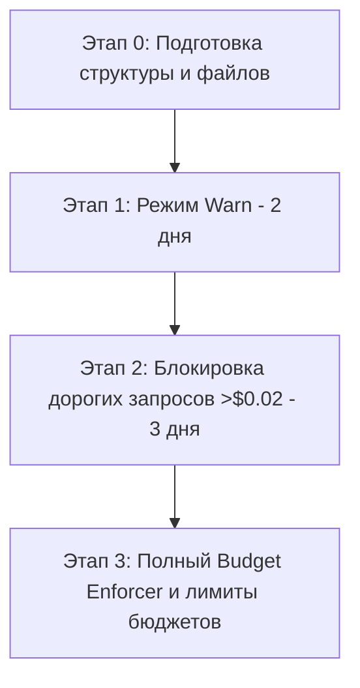

# Внедрение TOKEN-FIRST VIBE ENGINEERING в C:\Codex_Shared

**Версия:** 3.0 (Промышленный эталонный стандарт)  
**Цель:** Снижение расходов API токенов на 85–95% в общем контуре разработки `C:\Codex_Shared` без потери качества кода и с полной автоматизацией контроля лимитов.

---

## User Review Required

Ниже представлены ключевые концепции, которые будут применены в проектах общего контура. Проектная миграция будет проходить в 4 этапа для минимизации рисков прерывания процессов разработки.

---

## 1. Таблица лимитов для ИИ-ассистента (AGENTS.md)

В глобальном файле [AGENTS.md](file:///C:/Codex_Shared/AGENTS.md) будет зафиксирована жесткая таблица ограничений, которой ассистент обязан следовать под угрозой остановки сессии:

| Действие | Лимит | Примечание |
| :--- | :--- | :--- |
| **Чтение файла без строк** | Запрещено для файлов >50 строк | Требуется предварительный анализ индекса или сжатый просмотр |
| **Максимум строк за `view_file`** | 200 строк | Большие объемы считывать частями по мере необходимости |
| **Глубина поиска (`grep_search`)** | ≤ 3 уровня | Исключать глубокие вложенные пути |
| **Максимум файлов в одном `grep`** | 20 файлов | При превышении — сузить область поиска |
| **Автоисправления ошибок / тестов** | ≤ 3 попыток | После 3-й попытки остановиться и передать отчет инженеру |
| **История субагента** | ≤ 2000 токенов | Передавать только описание текущей изолированной задачи |
| **Ответ модели** | ≤ 4000 токенов | Избегать избыточного вывода и полного листинга неменяющихся файлов |

---

## 2. .aiignore и правила поиска

- Перед выполнением любого поиска (`grep_search`, `list_dir`) ассистент **обязан** прочесть глобальный файл [.aiignore](file:///C:/Codex_Shared/.aiignore).
- Все пути и паттерны, указанные в `.aiignore`, должны быть явно исключены из поисковых запросов и сканирования.
- Любое нарушение этого правила считается критической ошибкой, ведущей к перерасходу токенов и остановке работы.

---

## 3. Автоматизация Preflight Gateway и лимиты для ИИ

Для предотвращения человеческого фактора (когда разработчик забывает запустить калькулятор токенов перед запросом):
1. **Для ИИ-ассистента:** Перед выполнением любого шага, который повлечет передачу контекста объемом более **10 000 токенов**, ассистент обязан превентивно предупредить пользователя в чате:  
   *«Внимание: объем контекста для следующего шага составляет Х токенов. Ожидаемая стоимость: $Y. Продолжить?»*
2. **Для разработчика:** Внедряется набор удобных мета-команд (см. раздел 6).

---

## 4. Session Compression (Сжатие длинных диалогов)

Чтобы не заставлять разработчика вручную пересоздавать чат и улучшить UX:
- Ассистент отслеживает объем контекста.
- При приближении к лимиту (25k-30k токенов) ассистент автоматически генерирует в корне проекта файл `SESSION_SUMMARY.md`, содержащий:
  - Список решенных задач в текущей сессии;
  - Ссылки на измененные файлы и краткое описание изменений;
  - Список открытых вопросов и невыполненных задач.
- Если среда разработки/API не позволяет очистить историю программно, ассистент выводит четкую инструкцию разработчику:  
  *«Диалог перегружен. Я сохранил состояние сессии в SESSION_SUMMARY.md. Пожалуйста, начните новый чат и передайте мне этот файл для продолжения работы с чистым контекстом.»*

---

## 5. Безопасность и проверка секретов перед кэшированием

При работе скрипта `build_index.py` (индексатора) и логике работы `preflight.py`:
- Реализуется автоматическая проверка на наличие ключевых слов: `SECRET`, `KEY`, `PASSWORD`, `TOKEN`, `PRIVATE`.
- При обнаружении таких строк в анализируемом файле:
  - Данный файл **не включается** в глобальный индекс и не кэшируется в контексте.
  - Разработчику и в логи выводится предупреждение: `[WARNING] Файл <путь> содержит потенциальные секреты и был исключен из индексации.`

---

## 6. Мета-команды для разработчиков

Интегрируем в руководство [README_HOW_TO_USE.md](file:///C:/Codex_Shared/README_HOW_TO_USE.md) следующие команды управления экономией:

- `/estimate "мой промпт"` — оценить примерную стоимость запроса перед его отправкой.
- `/budget status` — показать текущий баланс дневного и недельного лимита.
- `/force` — принудительно выполнить дорогой запрос или операцию в обход предупреждений Preflight Gateway (все такие вызовы логируются в `token_usage.jsonl`).

## 6.1 Выбор модели (роутинг)

Для минимизации затрат используйте мета-теги в первой строке промпта:

| Тег | Модель | Когда использовать |
|-----|--------|--------------------|
| `#flash8b` | Gemini 1.5 Flash-8B | grep, поиск, документация, тесты, рефакторинг нейминга |
| `#flash` | Gemini 2.0 Flash (по умолчанию) | написание функций, исправление багов, анализ до 5 файлов |
| `#pro` | Gemini 1.5 Pro | архитектурные решения, сложная отладка, анализ >5 файлов |

Если тег не указан, ассистент использует `#flash`.

---

## 7. Протокол недостатка контекста (Fallback)

Если ассистент не может выполнить задачу из-за жестких ограничений на чтение файлов, он **не должен гадать или придумывать код**. Вместо этого он обязан выдать четкий структурированный запрос:
> *«Для реализации задачи мне недостаточно контекста. Мне необходимы следующие данные:*
> - *Файл `path/to/file_A.py` (строки X–Y)*
> - *Описание структуры класса `ClassName` в `path/to/file_B.py`*
> *Пожалуйста, разрешите расширить контекст для этих файлов.»*

---

## 8. Ожидаемая экономия и мотивация

| Сценарий использования | Без стандарта | Со стандартом | Экономия |
| :--- | :--- | :--- | :--- |
| **Исправление бага в одном файле** | ~15 000 токенов | ~800 токенов | **94.6%** |
| **Добавление функции (3 файла)** | ~40 000 токенов | ~3 000 токенов | **92.5%** |
| **Рефакторинг кода (10 файлов)** | ~120 000 токенов | ~15 000 токенов | **87.5%** |

---

## 9. Поэтапный план миграции (Маршрут внедрения)

### Этап 0: Подготовка (Текущий шаг)
- Создание папки `C:\Codex_Shared\.ai\` и скриптов в `C:\Codex_Shared\scripts\`.
- Запуск первой индексации проекта (`build_index.py`).

### Этап 1: Режим Warn (2 дня)
- Preflight Gateway запущен, но только предупреждает разработчика об объеме токенов без блокировки запросов.
- Сбор статистики в `token_usage.jsonl` для калибровки порогов.

### Этап 2: Блокировка дорогих запросов (3 дня)
- Включение блокировок для запросов стоимостью выше $0.02.
- Активация ручного обхода через команду `/force`.

### Этап 3: Полный Budget Enforcer
- Включение жестких лимитов дневного бюджета ($5.0 для Flash, $1.0 для Pro) и автодеградации моделей.

---

## 10. План верификации и метрики качества

Для контроля того, что жесткая экономия не снизила эффективность разработки, еженедельно отслеживаются следующие метрики:
1. **Процент задач, решённых с первой попытки (First-run Success Rate):** Доля задач, где код прошел проверку тестами/линтером за 1-2 итерации. Бенчмарк до внедрения: 82%. Цель: не ниже 80%.
2. **Среднее число уточняющих запросов (Clarification Rate):** Сколько раз ассистент запрашивал расширение контекста у разработчика на одну задачу. Норма: не более 2 раз.
3. **Фактическая экономия бюджета:** Сравнение затрат по логам `token_usage.jsonl` с расходами аналогичного периода до внедрения стандартов.
