# Манифест и регламент автоматической реанимации лидов 1С (LEAD_REACTIVATION_POLICY)

> **Статус документа:** Официальный корпоративный регламент проекта `projects/lead_reactivation`.  
> **Область действия:** Автономный конвейер возврата спящих контактов 1С:УНФ через создание черновиков писем в Roundcube IMAP (`sales@longwang.ru`).  
> **Связанные системы:** 1С:УНФ OData, DWH `marketing_db` (PostgreSQL 14 / pgvector), Roundcube IMAP Hostland, CRM Битрикс24.

---

## 1. Фундаментальные инварианты и правила безопасности

### Правило 1: Режим создания черновиков (Drafts Only Invariant)
* Робот **НИ ПРИ КАКИХ ОБСТОЯТЕЛЬСТВАХ НЕ ОТПРАВЛЯЕТ ПИСЬМА КЛИЕНТАМ НАПРЯМУЮ**.
* Все сгенерированные письма помещаются в папку `Черновики` (`Drafts` / `INBOX.Drafts`) почтового ящика `sales@longwang.ru`.
* Финальное решение об отправке письма принимает только ответственный сотрудник или руководитель в почтовом клиенте в один клик.

### Правило 2: Обязательные вложения (Presentation & Quote Attachment Guard)
Каждое создаваемое письмо реанимации **ОБЯЗАНО СОДЕРЖАТЬ ВЛОЖЕНИЯ**:
1. **Корпоративная презентация компании:** Файл `Презентация и референс-лист.pdf` (1.8 МБ) прикрепляется **всегда без исключений**.
2. **Историческое коммерческое предложение (КП) или спецификация:** Если в истории переписки с данным контрагентом/контактом ранее высылалось персональное КП, робот находит последний отправленный файл (PDF/Excel) и прикрепляет его к черновику. Клиент сразу видит контекст предыдущего обсуждения.

### Правило 3: HR Guard (Защита от контакта с соискателями)
* Перед формированием черновика робот сканирует досье и входящие письма на предмет маркеров резюме и соискателей вакансий (теги `резюме`, `отклик на вакансию`, `hh.ru`, `superjob`, `зарплатные ожидания`).
* Контакты соискателей строго блокируются от включения в коммерческие воронки продаж.

### Правило 4: Чистота обращений и имен (L1 Anti-Hallucination Guard)
* Категорически запрещены обращения вида *«Куликова, добрый день!»* или *«ООО Ромашка, здравствуйте!»*.
* Имя адресата валидируется через словарь русских и международных имен.
* Если имя в базе 1С содержит фамилию в начале без инициалов или вызывает сомнения, используется каноническое вежливое приветствие: **«Добрый день!»** или **«Здравствуйте!»**.

### Правило 5: Кулдауны и защита от спама (Cooldown Guard)
* Между шагами повторных касаний (Шаги 1–5) действует жесткий минимальный интервал **не менее 21 дня** (3 недели).
* После завершения 5 или 6 шага касаний контакт уходит в заморозку на **90 дней** (3 месяца).
* По выходным дням (суббота и воскресенье) генерация черновиков не производится.

### Правило 6: Кросс-чекинг с CRM Битрикс24 (Cross-System Conflict Guard)
* Перед взятием спящего контакта 1С в воронку реанимации выполняется проверка email в Битрикс24 (`crm.deal.list` и `crm.activity.list`).
* Если по клиенту есть активная сделка в работе или коммуникация менеджера за последние 30 дней — контакт **исключается из автоматической реактивации**, чтобы не сбивать живой диалог менеджера.

---

## 2. Архитектура двух потоков реанимации

```mermaid
flowchart TD
    Start["Запуск конвейера (run_daily_reactivation)"] --> CheckDay{"Рабочий день?<br/>(Пн-Пт)"}
    CheckDay -- Нет --> SkipWeekend["Пропуск: выходной день"]
    CheckDay -- Да --> LoadIntel["Загрузка базы 1С + DWH + Б24"]
    
    LoadIntel --> P1["ПОТОК 1: Повторные касания<br/>(ReactivationFunnelState)"]
    LoadIntel --> P2["ПОТОК 2: Первичный охват спящей базы<br/>(Inactivity > 30-40 дней)"]
    
    P1 --> CheckCD1{"Кулдаун 21 день прошел?"}
    CheckCD1 -- Нет --> SkipP1["Ожидание кулдауна"]
    CheckCD1 -- Да --> GenDraft1["Генерация письма Шага N<br/>+ Презентация + КП"]
    
    P2 --> CheckCRM{"Есть открытая сделка в Б24?"}
    CheckCRM -- Да --> SkipCRM["Пропуск: клиент в работе у менеджера"]
    CheckCRM -- Нет --> GenDraft2["Генерация Шага 1 (Прелюдия)<br/>+ Презентация + КП"]
    
    GenDraft1 --> SaveIMAP["Запись в IMAP Drafts (Roundcube)"]
    GenDraft2 --> SaveIMAP
    SaveIMAP --> UpdateState["Обновление состояния воронки + DWH трекер"]
```

---

## 3. Стандарты текста и тональности писем

1. **Запретные формулировки (Spam & Cliché Blacklist):**
   * *«Аккуратно напомнить о себе...»*
   * *«Вы про нас не забыли?»*
   * *«Решили вас побеспокоить...»*
   * *«Напоминаем, что мы существуем...»*
2. **Обязательные элементы тела письма:**
   * Ссылка на прошлый предмет диалога или номенклатуру (извлеченную из `skus_and_amounts` истории заказов 1С).
   * Актуальный инфоповод или ценность (прямые поставки оборудования из КНР, проведение безопасных платежей через филиалы в Сербии/Кыргызстане, логистика DDP).
   * Четкий и ненавязчивый Call-to-Action (CTA): *«Подскажите, актуальна ли потребность по данной позиции, или направить обновленные условия по аналогичным брендам?»*.
3. **Стандарт фирменной подписи:**
   * Строго по корпоративному формату Long Wang: Times New Roman, 12pt, ссылки на сайт, телефон `+7 (812) 509-1245` и список брендов-партнеров.

---

## 4. Контроль расхода токенов и трекинг (DWH / Metabase)

* Каждая операция генерации регистрируется в DWH таблице `llm_usage_ledger` с параметрами:
  * `task_type = 'lead_reactivation_summary'` — суммаризация истории переписки и карточки клиента.
  * `task_type = 'lead_reactivation_draft'` — генерация черновика письма автоворонки.
  * `initiated_by = 'system_cron'`.
* Лимиты суточного расхода контролируются переменной `DEEPSEEK_DAILY_LIMIT` (базовый лимит: 500 запросов/день).
