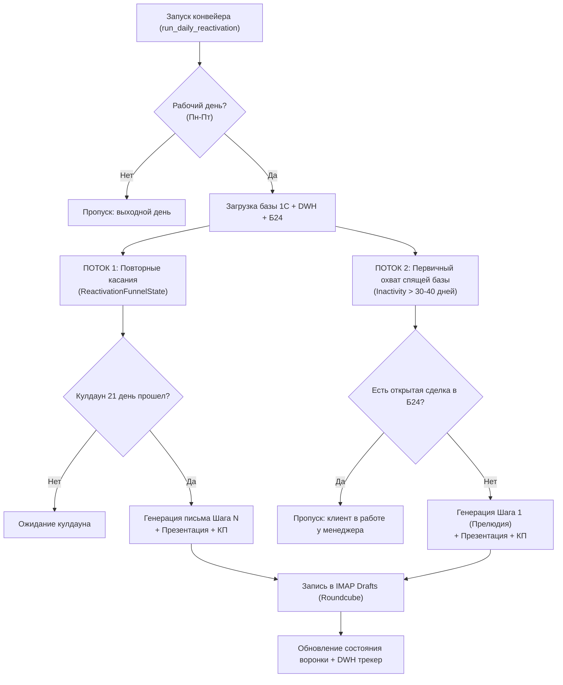

# Манифест и регламент автоматической реанимации лидов 1С (LEAD_REACTIVATION_POLICY)

> **Статус документа:** Официальный корпоративный регламент проекта `projects/lead_reactivation`.  
> **Область действия:** Автономный конвейер возврата спящих контактов 1С:УНФ через создание черновиков писем в Roundcube IMAP (`sales@longwang.ru`).  
> **Связанные системы:** 1С:УНФ OData, DWH `marketing_db` (PostgreSQL 14 / pgvector), Roundcube IMAP Hostland, CRM Битрикс24.

---

## 1. Фундаментальные инварианты и правила безопасности

### Правило 1: Режим создания черновиков (Drafts Only Invariant)
* Робот **НИ ПРИ КАКИХ ОБСТОЯТЕЛЬСТВАХ НЕ ОТПРАВЛЯЕТ ПИСЬМА КЛИЕНТАМ НАПРЯМУЮ**.
* Все сгенерированные письма помещаются в папку `Черновики` (`Drafts` / `INBOX.Drafts`) почтового ящика `sales@longwang.ru`.
* Финальное решение об отправке письма принимает только ответственный сотрудник или руководитель в почтовом клиенте в один клик.

### Правило 2: Обязательные вложения (Presentation & Quote Attachment Guard)
Каждое создаваемое письмо реанимации **ОБЯЗАНО СОДЕРЖАТЬ ВЛОЖЕНИЯ**:
1. **Корпоративная презентация компании:** Файл `Презентация и референс-лист.pdf` (1.8 МБ) прикрепляется **всегда без исключений**.
2. **Историческое коммерческое предложение (КП) или спецификация:** Если в истории переписки с данным контрагентом/контактом ранее высылалось персональное КП, робот находит последний отправленный файл (PDF/Excel) и прикрепляет его к черновику. Клиент сразу видит контекст предыдущего обсуждения.

### Правило 3: HR Guard (Защита от контакта с соискателями)
* Перед формированием черновика робот сканирует досье и входящие письма на предмет маркеров резюме и соискателей вакансий (теги `резюме`, `отклик на вакансию`, `hh.ru`, `superjob`, `зарплатные ожидания`).
* Контакты соискателей строго блокируются от включения в коммерческие воронки продаж.

### Правило 4: Чистота обращений и имен (L1 Anti-Hallucination Guard)
* Категорически запрещены обращения вида *«Куликова, добрый день!»* или *«ООО Ромашка, здравствуйте!»*.
* Имя адресата валидируется через словарь русских и международных имен.
* Если имя в базе 1С содержит фамилию в начале без инициалов или вызывает сомнения, используется каноническое вежливое приветствие: **«Добрый день!»** или **«Здравствуйте!»**.

### Правило 5: Кулдауны и защита от спама (Cooldown Guard)
* Между шагами повторных касаний (Шаги 1–5) действует жесткий минимальный интервал **не менее 21 дня** (3 недели).
* После завершения 5 или 6 шага касаний контакт уходит в заморозку на **90 дней** (3 месяца).
* По выходным дням (суббота и воскресенье) генерация черновиков не производится.

### Правило 6: Кросс-чекинг с CRM Битрикс24 (Cross-System Conflict Guard)
* Перед взятием спящего контакта 1С в воронку реанимации выполняется проверка email в Битрикс24 (`crm.deal.list` и `crm.activity.list`).
* Если по клиенту есть активная сделка в работе или коммуникация менеджера за последние 30 дней — контакт **исключается из автоматической реактивации**, чтобы не сбивать живой диалог менеджера.

### Правило 7: Автоматический Bounce & Unsubscribe Guard (Сквозное удаление невалидной почты)
* При фиксации ошибки доставки письма (`mailer-daemon`, `550 User not found`) или прямого отказа от коммуникации («не пишите больше», «отпишите», «компания ликвидирована»):
  1. Немедленно вызывается процедура пайплайна [sync_leads_1c_bitrix.py](file:///C:/Codex/projects/1c_odata/scripts/sync_leads_1c_bitrix.py) с ключом `--clean-email <email> --reason <bounce|unsubscribe>`.
  2. **В Битрикс24 CRM:** данный email удаляется из сущностей Контакта, Компании и Лида (`crm.contact.update`, `crm.company.update`, `crm.lead.update`). В таймлайн вносится системная запись об исключении адреса.
  3. **В 1С:УНФ:** через OData PATCH из табличной части `КонтактнаяИнформация` (`Catalog_Лиды` и `Catalog_Контрагенты`) удаляется строка `АдресЭлектроннойПочты`.
  4. **В DWH:** в `ClientIntel` проставляется статус `DO_NOT_CONTACT`, контакт навсегда блокируется от генераций и списания токенов LLM.

### Правило 8: 5-ступенчатый Pre-Flight Filter отбора кандидатов
Перед генерацией любого черновика реанимации (и в Потоке 1 «Повторные касания», и в Потоке 2 «Первичный охват базы 1С») обязателен вызов процедуры `check_client_reactivation_eligibility()`:
1. **Входящие письма за последние 30 дней:** если адрес присылал входящее письмо в таблицу `email_messages` $\rightarrow$ отмена генерации (`"Клиент в активном контакте, реанимация запрещена"`).
2. **Активные сделки в Битрикс24 CRM:** опрос `crm.deal.list` с фильтром `STAGE_SEMANTIC = 'process'` по контакту и компании. Если есть открытая сделка $\rightarrow$ отмена (`"В CRM есть активная сделка в работе у менеджера"`).
3. **Активные лиды и недавние касания в Битрикс24 CRM (Touchpoint Guard):**
   - Опрос `crm.lead.list` по email: при наличии лида в стадии `process` авто-реанимация отменяется.
   - Опрос `crm.activity.list` с фильтром `>=START_TIME: now - 30 дней` по Контактам (`OWNER_TYPE_ID: 3`), Компаниям (`OWNER_TYPE_ID: 4`) и Лидам (`OWNER_TYPE_ID: 1`). Если менеджер звонил, писал письмо или создавал дело/встречу в течение последних 30 дней $\rightarrow$ отмена (`"В Битрикс24 зафиксирована недавняя активность менеджера"`).
4. **Кулдаун ценовых возражений и претензий (60 дней):** если в `ai_summary` или истории зафиксированы маркеры «дорого», «отказ по цене», «претензия», «штраф», «суд» $\rightarrow$ пауза **не менее 60 дней** от даты последнего контакта.
5. **Bounce & Unsubscribe Guard:** автоматическое исключение невалидных адресов.

### Правило 9: Идемпотентное СБИС-обогащение (Zero-Duplicate Guard)
1. Перед вызовом нейросети проверяется наличие ключа `company_summary.sbis_profile` в DWH/кэше.
2. Если досье отсутствует — вызывается канонический модуль `[check_contractor.py](file:///C:/Codex/projects/1c_odata/scripts/check_contractor.py)` (DaData API + Saby RPC).
3. Данные синхронно записываются в 3 системы:
   - `marketing_db`: `client_intel.sbis_profile` + отметка `sbis_checked_at`;
   - `Битрикс24 CRM`: поле `COMMENTS` через regex-функцию `_merge_sbis_block` + закрепленный комментарий таймлайна;
   - `1С:УНФ`: типовой реквизит `Комментарий` в `Catalog_Контрагенты` / `Catalog_Лиды` + существующие в базе теги (без создания новых сущностей).
4. Параметры масштаба (выручка, ОКВЭД, вердикт, тендеры) обязательно передаются в системный промпт LLM для точного позиционирования коммерческого предложения (оптовик vs завод vs конечный заказчик).

### Правило 10: Quality Gate по коммерческим предложениям (45-Day Quote Age Limit)
* При поиске исторического КП функция `find_last_kp_attachment` проверяет дату отправки исходного файла/письма.
* Если возраст файла превышает **45 дней**, прикрепление КП категорически запрещено (клиенту отправляется только свежая презентация и подбор аналогов). Запрещено высылать устаревшие расчеты полугодовой или годовой давности с неактуальными курсами и ценами.

### Правило 11: Intent Classification Gate (Защита от сбоя контекста)
* Перед каждым шагом воронки робот анализирует текст последнего входящего письма от клиента:
  - **Маркеры активного заказа / доставки / счета / договора** («отправьте Деловыми Линиями», «СДЭК», «выставите счет», «договор», «реквизиты») $\rightarrow$ присвоение статуса `order_active` и немедленная остановка автоматической воронки для ручной обработки менеджером.
  - **Маркеры жесткого отказа / отписки / покупки у других** («не пишите», «отпишите», «купили у других», «не актуально») $\rightarrow$ статус `rejected`, автоматическое закрытие воронки (`completed`).
  - **Маркеры ценового возражения** («дорого», «цена космос», «не проходим по бюджету») $\rightarrow$ статус `price_objection`, передача контекста в нейросеть для аргументации преимуществ (надежность прямых поставок из КНР, отсутствие санкционных рисков третьих стран, подбор китайских брендов-аналогов) **без шаблонных упреков в молчании**.

### Правило 12: Двухпоточная балансировка суточного лимита (--active-limit и --limit)
* Суточный лимит создания черновиков разделяется на две независимые квоты:
  - `--active-limit`: для ведения активных клиентов по шагам 2–6 (по умолчанию 50% суточной квоты).
  - `--limit`: для захода на новые спящие контакты из 1С (Шаг 1).
* Активные воронки не имеют права монополизировать суточный лимит. Новые кандидаты из 1С обязаны получать регулярный суточный слот для первого касания.

### Правило 13: Fast Quota Failover и отказоустойчивость LLM
* Для предотвращения зависаний при обращении к внешним нейросетям (квоты 429 RESOURCE_EXHAUSTED Gemini) в `llm_service.py` действует аппаратный таймаут 15 секунд на каждый HTTP-запрос через `ThreadPoolExecutor`.
* При получении ошибки квоты 429 ключ немедленно помечается как `exhausted` с кулдауном, а запрос мгновенно переключается на DeepSeek Chat.
* DeepSeek Chat является основным стандартным провайдером для генерации B2B писем.

---

## 2. Архитектура двух потоков реанимации

---

## 3. Стандарты текста и тональности писем

1. **Запретные формулировки (Spam & Cliché Blacklist):**
   * *«Аккуратно напомнить о себе...»*
   * *«Вы про нас не забыли?»*
   * *«Решили вас побеспокоить...»*
   * *«Напоминаем, что мы существуем...»*
   * *B2C-дисконт и искусственная спешка:* категорически запрещены фразы вроде *«скидка 10% до конца недели»*, *«акция сгорает сегодня»*, *«специальное предложение только для вас»*. В промышленном B2B оборудовании это уничтожает доверие ЛПР.
2. **Обязательные элементы тела письма:**
   * Ссылка на прошлый предмет диалога или номенклатуру (извлеченную из `skus_and_amounts` истории заказов 1С).
   * Актуальный инфоповод или ценность (прямые поставки промышленной автоматики из КНР, проведение безопасных платежей в юанях, доставка под ключ DDP РФ с закрывающими документами).
   * **Строго ОДИН конкретный вопрос в конце (Single CTA Invariant):** письмо завершается ровно одним емким вопросом (например: *«Подскажите, актуальна ли потребность по данной позиции, или направить обновленные условия по аналогичным азиатским брендам?»*). Запрещено задавать два разных вопроса подряд (*«В чем причина паузы? И какой у вас дедлайн?»*), это создает тавтологию и перегружает клиента.
3. **Стандарт фирменной подписи:**
   * Строго по корпоративному формату Long Wang: Times New Roman, 12pt, ссылки на сайт, телефон `+7 (812) 509-1245` и список брендов-партнеров.

---

## 4. Контроль расхода токенов и трекинг (DWH / Metabase)

* Каждая операция генерации регистрируется в DWH таблице `llm_usage_ledger` с параметрами:
  * `task_type = 'lead_reactivation_summary'` — суммаризация истории переписки и карточки клиента.
  * `task_type = 'lead_reactivation_draft'` — генерация черновика письма автоворонки.
  * `initiated_by = 'system_cron'`.
* Лимиты суточного расхода контролируются переменной `DEEPSEEK_DAILY_LIMIT` (базовый лимит: 500 запросов/день).

---

## 5. Корпоративная RAG-база знаний и коммуникаций (`kb_leads_v1`)

Пайплайн генерации писем использует каноническую базу знаний **[projects/n8n_email_ai/kb_leads_v1/](file:///C:/Codex/projects/n8n_email_ai/kb_leads_v1/)**:
1. **Оглавление и манифест базы:** [00_manifest.md](file:///C:/Codex/projects/n8n_email_ai/kb_leads_v1/00_manifest.md)
2. **Паспорт источников и аналитическое саммари:** [99_sources_and_notes.md](file:///C:/Codex/projects/n8n_email_ai/kb_leads_v1/99_sources_and_notes.md)
3. **Индекс 96 статей и кейсов:** [96_articles_index.md](file:///C:/Codex/projects/n8n_email_ai/kb_leads_v1/96_articles_index.md) и правила селекции [95_article_selection_rules.md](file:///C:/Codex/projects/n8n_email_ai/kb_leads_v1/95_article_selection_rules.md)
4. **Канонические шаблоны черновиков:** [50_reactivation_templates.md](file:///C:/Codex/projects/n8n_email_ai/kb_leads_v1/50_reactivation_templates.md) и [40_email_templates.md](file:///C:/Codex/projects/n8n_email_ai/kb_leads_v1/40_email_templates.md)
5. **Транскрибации реальных телефонных разговоров:**
   * Канонические пруф-поинты: [15_proof_points_from_calls.md](file:///C:/Codex/projects/n8n_email_ai/kb_leads_v1/15_proof_points_from_calls.md)
   * Дословные обороты Спикера 2: [15_call_phrase_candidates_speaker2.md](file:///C:/Codex/projects/n8n_email_ai/kb_leads_v1/15_call_phrase_candidates_speaker2.md)
6. **Правила тональности и фильтрации:** [60_tone_rules.md](file:///C:/Codex/projects/n8n_email_ai/kb_leads_v1/60_tone_rules.md) и [90_pre_send_checklist.md](file:///C:/Codex/projects/n8n_email_ai/kb_leads_v1/90_pre_send_checklist.md)

