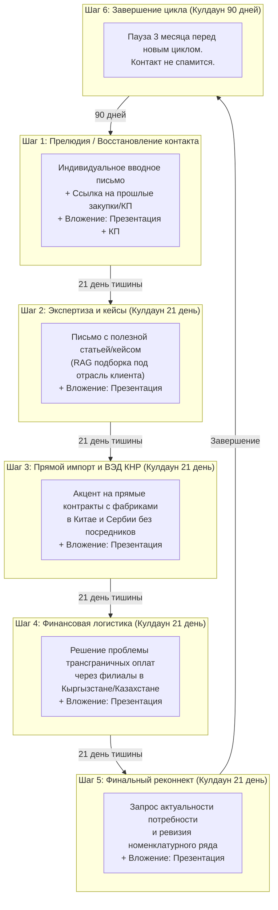

# Карта и архитектура двух воронок реанимации клиентов (REACTIVATION_FUNNELS_MAP)

> **Статус:** Техническая спецификация автоворонок возврата спящей базы 1С.  
> **Связанные скрипты:** [run_daily_reactivation.py](file:///C:/Codex/projects/lead_reactivation/scripts/run_daily_reactivation.py).

---

## 1. Концепция двух параллельных потоков

Конвейер реанимации работает по принципу разделения базы на два непересекающихся потока:
1. **Поток 1 (Nurturing / Повторные касания):** Клиенты, которые уже находятся внутри многошаговой цепочки касаний. Робот отслеживает соблюдение интервала в 21 день между шагами и генерирует черновик следующего этапа с постепенной сменой смыслового акцента.
2. **Поток 2 (Cold Outreach / Первичный охват спящей базы):** Спящие контакты из 1С:УНФ, по которым не было никакой коммуникации более 30–40 дней и нет открытых сделок в Битрикс24. Робот готовит для них мягкое вводное письмо (Шаг 1: Прелюдия) и переводит в активную воронку.

---

## 2. Архитектура воронки Потока 1 (Многошаговая цепочка 1–6)

---

## 3. Таблица этапов и смысловых шаблонов

| Шаг воронки | Кулдаун до след. шага | Смысловой акцент | Обязательные вложения | Ключевая цель шага |
|---|---|---|---|---|
| **Шаг 1 (Прелюдия)** | 21 день | Восстановление диалога по ранее обсуждавшимся позициям/брендам из 1С. | `Презентация и референс-лист.pdf` + **Историческое КП** (при наличии). | Напомнить о себе в контексте реальной деловой пользы. |
| **Шаг 2 (Экспертиза)** | 21 день | Подборка профильной статьи/кейса из базы знаний компании под отрасль клиента. | `Презентация и референс-лист.pdf`. | Показать компетенции и инженерный уровень без прямого навязывания. |
| **Шаг 3 (ВЭД КНР)** | 21 день | Прямые контракты в Китае (Дечжоу) и Сербии. Промышленное оборудование и сложные аналоги. | `Презентация и референс-лист.pdf`. | Предложить альтернативу дефицитным европейским брендам. |
| **Шаг 4 (Оплаты)** | 21 день | Безопасные платежи в валюте через филиалы в СНГ (Кыргызстан, Казахстан) и логистика DDP. | `Презентация и референс-лист.pdf`. | Снять главный страх клиентов по блокировке внешних платежей. |
| **Шаг 5 (Реконнект)** | 90 дней | Прямой вопрос о текущих проектах на квартал, предложение обновить спецификацию. | `Презентация и референс-лист.pdf`. | Финальное выяснение планов на сезон. |

---

## 4. Условия автоматического выхода из воронки (Exit Criteria)

Контакт немедленно и бесповоротно **выходит из воронки реанимации** при наступлении любого из событий:
1. **Клиент ответил на письмо:** Почтовый конвейер фиксирует входящий `EmailMessage` от домена/адреса клиента. Запускается оповещение менеджера в CRM Битрикс24, контакт помечается как `Active Conversation`, дальнейшие касания робота прекращаются.
2. **Менеджер создал сделку в Битрикс24:** Появление открытой сделки по данному контрагенту автоматически блокирует генерацию черновиков.
3. **Отказ от коммуникации (Unsubscribe / Hard Stop):** При получении фраз *«не пишите больше»*, *«не актуально»*, *«мы закрылись»* робот ставит статус `UNSUBSCRIBED` / `DO_NOT_CONTACT` в `ClientIntel`.
4. **Bounce / Ошибка доставки:** Письмо возвращено почтовым демоном (`mailer-daemon` / `550 User not found`). Адрес исключается из активных списков.
